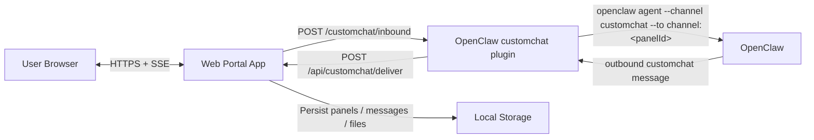

# Architecture

当前项目使用 Slack-style 自定义 channel：

## Key Points

- app 不直接持有 Gateway WS
- 插件才是 OpenClaw 里的 channel adapter
- panel 被映射成 `channel:<panelId>`
- app 负责界面和持久化，插件负责 OpenClaw ingress / outbound
