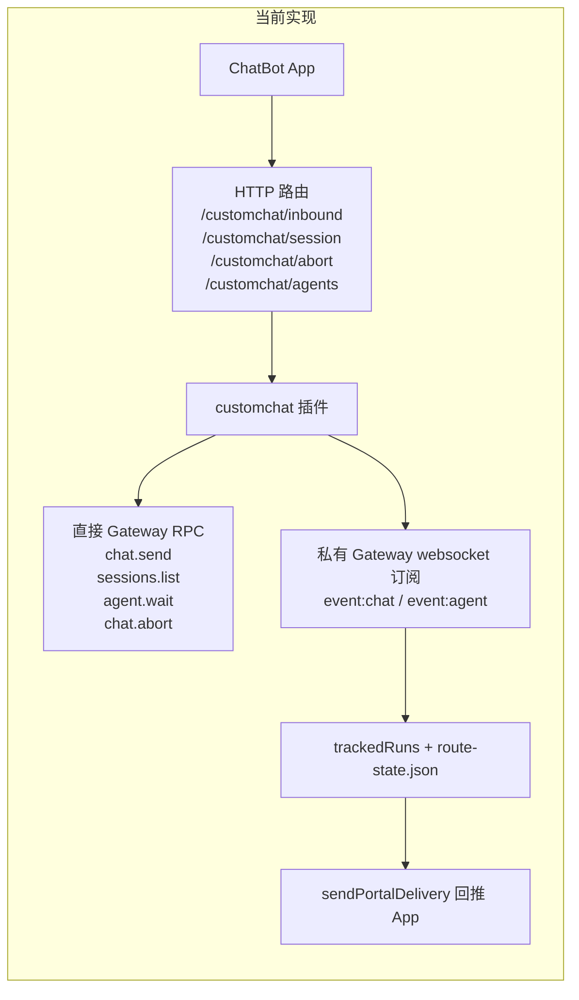
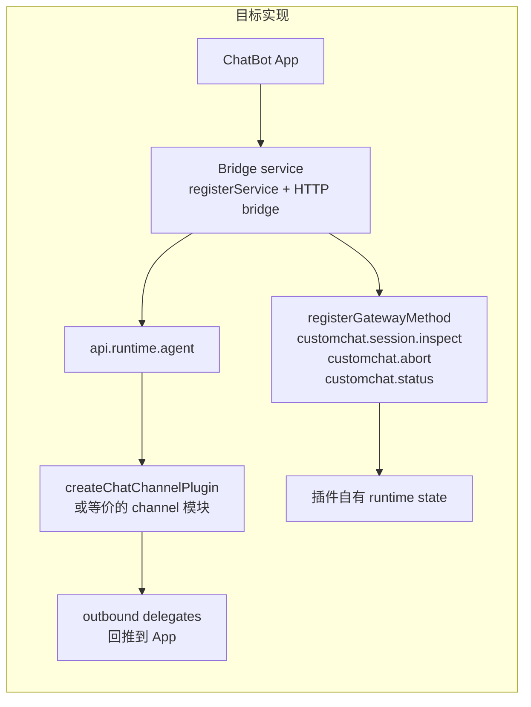

# CustomChat 插件改造方案

## 目标

这份文档用于记录当前仓库中 OpenClaw `customchat` 插件的改造方案。

这次改造的目标不是一次性重写，而是：

- 在迁移过程中保持插件可用
- 降低未来升级 OpenClaw 时的兼容性风险
- 逐步贴近官方最新插件 SDK 架构
- 明确拆分 channel、bridge runtime、control plane 三类职责

## 范围

本方案主要覆盖以下文件：

- `plugins/customchat/index.ts`
- `plugins/customchat/plugin-runtime.ts`
- `plugins/customchat/gateway-transport.ts`
- `plugins/customchat/route-state-store.ts`
- `plugins/customchat/storage.ts`
- `plugins/customchat/utils.ts`
- `plugins/customchat/openclaw.plugin.json`
- `plugins/customchat/package.json`

## 官方基线

本方案参考了当前官方公开的插件设计和官方内置插件样例：

- 插件总览：`https://docs.openclaw.ai/tools/plugin`
- Manifest 说明：`https://docs.openclaw.ai/plugins/manifest`
- SDK 迁移说明：`https://docs.openclaw.ai/plugins/sdk-migration`
- 官方 Matrix channel 插件：
  - `https://github.com/openclaw/openclaw/blob/v2026.3.24/extensions/matrix/index.ts`
  - `https://github.com/openclaw/openclaw/blob/v2026.3.24/extensions/matrix/src/channel.ts`
- 官方 Voice Call 插件：
  - `https://github.com/openclaw/openclaw/blob/v2026.3.24/extensions/voice-call/index.ts`
  - `https://github.com/openclaw/openclaw/blob/v2026.3.24/extensions/voice-call/package.json`

## 当前架构

## 目标架构

## 状态说明

| 状态 | 含义 |
|---|---|
| `Completed` | 当前分支已经完成。 |
| `Partial` | 已经有基础改造，但还未达到最终目标。 |
| `Not started` | 尚未开始。 |
| `Deferred` | 明确后移到更晚阶段。 |

## 改造项总表

| 改造项 | 当前实现 | 主要问题 | 官方方向 | 建议改造 | 难度 | 风险 | 完成状态 | 阶段 |
|---|---|---|---|---|---|---|---|---|
| Manifest 清理 | `openclaw.plugin.json` 中仍含 `entry` | Manifest 不应该承担代码入口声明 | Manifest 只负责发现、配置和 UI 提示 | 删除 `entry`，保留 `channels`、`configSchema`、`uiHints` | 低 | 低 | Completed | P0 |
| Host 版本边界 | `package.json` 原先没有 `peerDependencies.openclaw` 与 `minHostVersion` | 升级 OpenClaw 时没有明确兼容边界 | 官方插件会声明 `peerDependencies` 和 `openclaw.install.minHostVersion` | 增加经过验证的宿主版本范围与安装元数据 | 低 | 低 | Completed | P0 |
| 插件入口形式 | 旧实现为 `activate(api)` 手工注册 | 能工作，但不是官方主推入口形式 | `defineChannelPluginEntry(...)` 或 `definePluginEntry(...)` | 切到 SDK 风格入口，同时保持现有行为兼容 | 低 | 低 | Completed | P1 |
| Channel 模块边界 | plugin 对象原先直接在大文件中拼装 | channel 职责和 bridge/control plane 混在一起 | 独立 channel 模块 | 已提取 `channel.ts`，由入口统一装配 channel 能力 | 中 | 中 | Completed | P2 |
| 直接调用 `chat.send` | App 入站消息原先直接触发底层 Gateway RPC | 强依赖低层 RPC 行为 | 更高层的 runtime/channel 抽象 | 已收口到 `gateway-transport.ts` 的 `sendGatewayChatTurn()` 适配层，业务层不再散落直接 RPC 字符串 | 中 | 中 | Completed | P2 |
| 直接调用 `sessions.list` | 会话检查原先直接扫描 Gateway session 输出 | 依赖返回结构，升级时脆弱 | 插件自有 runtime state + gateway method | 已新增 `customchat.session.inspect`，并改为 runtime-first；Gateway 扫描仅保留在 transport fallback | 中 | 中 | Completed | P3 |
| 直接调用 `agent.wait` | 中止确认和恢复原先直接依赖 `agent.wait` | 强耦合到底层 run 生命周期 | 事件驱动 + runtime state | 已收口到 `gateway-transport.ts` 的 `waitForGatewayRun()`；业务层改为 runtime-first，`agent.wait` 仅保留为 fallback 校验 | 中 | 中 | Completed | P3 |
| 直接调用 `chat.abort` | 中止接口原先直接发低层 abort | 强依赖内部取消语义 | 插件对外暴露稳定控制方法 | 已新增 `customchat.abort` gateway method，并收口到 `abortGatewaySession()` 适配层；HTTP abort 与控制面复用一套 helper | 中 | 中 | Completed | P3 |
| 私有 Gateway WS 订阅 | 插件原先自己维持 subscriber 和事件恢复 | 是当前升级风险最高的点之一 | service/runtime 生命周期管理 | 已新增 `subscriber-service.ts`，将启动、重连、恢复循环迁移到独立模块，并通过 `registerService(...)` 挂载 | 高 | 高 | Completed | P4 |
| route-state 恢复 | 通过 `route-state.json` 和猜测 session key 恢复绑定 | 恢复逻辑原先散在 runtime 中 | runtime state 为主，持久化只做恢复缓存 | 已提取 `route-state-store.ts`，运行态以 runtime-first 为主；route-state 仅保留绑定缓存与重启恢复职责 | 中 | 中 | Completed | P3 |
| HTTP bridge 路由 | `/customchat/inbound`、`/session`、`/abort`、`/agents`、`/agent-avatar` 直接连到内部实现 | App API 与插件内部实现耦合过深 | HTTP 面可以保留，但内部应该调用稳定 runtime/method | 已保留现有 HTTP API，并通过 `http-routes.ts` / `bridge-service.ts` 统一装配，对内调用 runtime/method 层 | 低 | 低 | Completed | P2 |
| Agent 列表与头像读取 | 直接读取 `~/.openclaw/openclaw.json` 和 `IDENTITY.md` | 有用，但不是明确的高层官方 API | 当前官方样例里未看到明确替代层 | 当前能力保留；因官方暂无明确替代面，先作为隔离的兼容层保留 | 低 | 低 | Completed | P4 |
| Target 归一化 | `utils.ts` 已集中处理 `direct:*`、`group:direct:*:role:*`、`grp:*` | 需要有稳定的 target/session 入口 | target/session adapter 独立化 | 入口、控制面和 route-state 现在统一走相同的 target 归一化流程 | 低 | 低 | Completed | P1 |
| 文件边界 | 原先 `index.ts` 同时负责入口、RPC、subscriber、HTTP、状态和 helper | 文件过大，认知负担和回归风险都很高 | 官方样例会拆 entry/runtime/channel/setup/adapters | 已拆出 `index.ts`、`channel.ts`、`bridge-service.ts`、`http-routes.ts`、`runtime-state.ts`、`gateway-transport.ts`、`route-state-store.ts`、`storage.ts` 等模块 | 中 | 中 | Completed | P2 |

## 分期计划

| 阶段 | 目标 | 交付物 | 依赖 | 完成状态 |
|---|---|---|---|---|
| P0 | 规范元数据与版本边界 | 删除 manifest `entry`；增加 `peerDependencies.openclaw`；增加 `openclaw.install.minHostVersion` | 无 | Completed |
| P1 | 先改插件壳，不改核心行为 | 引入 `defineChannelPluginEntry(...)`；保留兼容包装；继续集中 target/session adapter | 建议先完成 P0 | Completed |
| P2 | 拆分 channel 与 bridge 职责 | 已建立 `channel.ts`、`bridge-service.ts`、`http-routes.ts`、`runtime-state.ts` 等薄模块，并继续补充 `gateway-transport.ts` / `storage.ts` / `route-state-store.ts`，保持现有 HTTP API 不变 | P1 | Completed |
| P3 | 替换大部分直接 Gateway 控制调用 | 已引入 `customchat.session.inspect`、`customchat.abort`、`customchat.status`；inspect 为 runtime-first，HTTP 控制面复用内部 helper，并将低层 RPC 收口到 `gateway-transport.ts` | P2 | Completed |
| P4 | 降低对私有 Gateway 事件流的依赖 | 已通过 `registerService(...)` 接管启动路径，并新增 `subscriber-service.ts` 承接 subscriber/recovery 生命周期；route-state 持久化与恢复逻辑也已独立成 `route-state-store.ts` | P3 | Completed |

## 当前建议顺序

建议优先按下面顺序推进：

1. `P0`
2. `P1`
3. `P2`

原因：

- 这三步能先把插件“壳层”和职责边界整理好
- 对现有行为影响最小
- 能显著降低后续继续做 `P3/P4` 时的复杂度

`P3` 和 `P4` 在本分支已完成第一轮结构收口，后续若继续演进，重点会落在长期兼容性观察，而不是再次回到“大文件混合实现”。

## 遗留观察

以下内容不再阻塞当前重构收尾，但仍值得后续持续观察：

- `gateway-transport.ts` 里仍然封装着对 OpenClaw 私有 RPC / WebSocket 的依赖；这层已经被隔离，但并没有被官方高层 API 完全替代。
- Agent 列表与头像读取目前仍依赖 `~/.openclaw/openclaw.json` 和工作区 `IDENTITY.md`；官方样例暂未给出更稳定的高层接口。
- `route-state.json` 已降级为绑定缓存与重启恢复用途，但只要 App 和 Gateway 之间仍需要外部 bridge，对这类轻量持久化映射就仍然有现实价值。

## 后续迁移决策表

下表用于回答一个更实际的问题：在当前重构已经完成的前提下，哪些核心 Gateway RPC 仍值得继续往官方高层能力迁移，哪些更适合作为兼容层长期保留。

| 能力 | 当前用途 | 迁移优先级 | 是否建议继续迁移 | 当前判断 |
|---|---|---|---|---|
| `chat.send` | 从 App 入站消息发起一轮新的 agent 会话 | 高 | 建议 | 这是最像官方未来希望由 `api.runtime.agent` 承接的能力，值得优先研究 |
| `chat.abort` | 主动中止当前 session / run | 中 | 视官方 runtime 取消面成熟度再决定 | 方向上值得迁，但目前保留在 transport 层更稳妥 |
| `agent.wait` | 查询 run 是否终态，用于恢复与 reconcile | 中 | 暂不强推 | 更适合逐步弱化为 fallback，而不是立即硬迁 |
| Gateway WS event subscriber | 订阅 `event:chat` / `event:agent` 驱动 bridge 流程 | 中 | 不建议短期彻底移除 | 对 bridge 插件仍然很有现实价值，但应限制在 `service/subscriber` 层 |
| `sessions.list` | session inspect fallback、会话键解析、恢复辅助 | 低 | 暂不建议 | 更像诊断/恢复能力，官方暂无明确高层稳定替代 |
| `sessions.delete` | 删除 session 与 transcript | 低 | 暂不建议 | 偏管理能力，短期保留在兼容层即可 |
| `chat.history` | 实时事件缺失时从历史补回文本和终态 | 低 | 暂不建议 | 偏恢复能力，短期没有明显更好的高层替代 |

### 结论

- 如果后续只继续推进一项，优先研究 `chat.send -> api.runtime.agent`
- `chat.abort` 和 `agent.wait` 可以继续观察官方 runtime 面再决定
- `sessions.list`、`sessions.delete`、`chat.history` 与 WS subscriber 暂时保留在适配层是合理的

## `chat.send -> api.runtime.agent` 迁移核对清单

在考虑把 `chat.send` 从核心 Gateway RPC 迁到 `api.runtime.agent` 之前，需要先确认下面这些能力是否能被 runtime 面覆盖。只有关键语义能对齐，迁移才值得做。

| 核对项 | 为什么重要 | 当前 `launchChatTurn()` 是否依赖 |
|---|---|---|
| 是否允许调用方显式指定 `sessionKey` | `customchat` 当前用规范化后的 session key 维持稳定路由与恢复 | 是 |
| 是否保留 `target` / channel 目标语义 | 当前会话键和后续回流都依赖 `target`，尤其是 `group:direct:{panelId}:role:{groupRoleId}` | 是 |
| 是否支持 `idempotencyKey` 或等价去重键 | 当前直接用 `messageId` 做幂等，避免重复发起 turn | 是 |
| 是否能立即返回 `runId` 或稳定的运行句柄 | `trackedRuns`、route-state 和后续事件关联都要靠它 | 是 |
| 是否能关闭或绕开自动投递（等价于当前 `deliver: false`） | `customchat` 自己负责 bridge 回 App，如果 runtime 自动再投一份，容易出现重复投递 | 是 |
| 是否能让插件掌握“真实 session key”或可靠句柄 | 当前发送后还会做一次实际 session key 解析，用于后续 inspect / delete / abort | 是 |
| 是否支持当前消息内容的完全透传 | 当前发送的是已经拼接好附件描述、routing hint 的整段消息 | 是 |
| 是否能与现有流式事件机制配合 | 当前 UI 增量更新依赖 run 与事件流对齐 | 是 |
| 是否能与后续 abort / inspect 协同 | 如果 send 改走 runtime，但 abort / inspect 仍走核心 RPC，必须有一致的 run/session 关联 | 是 |

## 当前 `launchChatTurn()` 语义对照

当前实现位置：

- [plugin-runtime.ts](../plugins/customchat/plugin-runtime.ts#L2242)

它目前做了这几件事：

| 当前语义 | 当前实现方式 | 迁移到 `api.runtime.agent` 时的潜在卡点 |
|---|---|---|
| 先构造规范化的 `expectedSessionKey` | `buildCanonicalSessionKey(agentId, target)` | runtime 是否允许显式控制 session key，不明确 |
| 发起一轮新会话 | `sendGatewayChatTurn({ sessionKey, idempotencyKey, message })` | runtime 是否支持完全等价的调用参数，需要核对 |
| 幂等去重 | `idempotencyKey = messageId` | runtime 未必暴露同名或等价字段 |
| 发送时不让 Gateway 直接替插件 delivery | 当前底层语义依赖 `deliver: false` | runtime 是否默认会自动投递，需要核对 |
| 从返回值里解析 `runId` | 优先取 `payload.runId` / `payload.result.runId` | runtime 是否会立即返回可用于追踪的 run 标识，需要核对 |
| 发起后再解析真实 session key | `resolveActualSessionKey(...)` 通过 session 侧信息校准 | runtime 可能只给抽象句柄，不给底层 session key |
| 对外返回 `{ runId, status, sessionKey, expectedSessionKey }` | 上层依赖这些字段写 route-state 和 trackedRuns | 如果 runtime 不能同时给这些信息，上层结构就得一起改 |

### 最可能卡住 migration 的点

如果只看当前 `launchChatTurn()`，真正最可能卡住 `chat.send -> api.runtime.agent` 的不是“发消息本身”，而是下面四个语义：

1. 是否允许显式指定 `sessionKey`
2. 是否有等价的 `idempotencyKey`
3. 是否能避免自动 delivery，保留 bridge 插件自己的投递路径
4. 是否能稳定拿到 `runId + 实际 session 关联信息`

### 建议

- 在没有确认以上 4 点之前，不建议直接替换 `chat.send`
- 后续如果要继续迁，建议先做一个最小验证：
  - 单独写一条实验路径，验证 `api.runtime.agent` 是否能覆盖 `launchChatTurn()` 的关键语义
  - 如果只能覆盖“发起运行”，但覆盖不了 `sessionKey / idempotency / deliver: false / runId`，那就不值得强迁

## 备注

- 本方案基于官方插件 SDK 方向和官方内置插件样例整理。
- 当前官方没有一个和 `customchat` 这种“外部 Web App bridge”完全一一对应的内置样例。
- 因此，文档中关于 `sessions.list / agent.wait / chat.abort` 的替代路径，是结合官方样板给出的重构方案，不是直接照搬单一官方实现。
