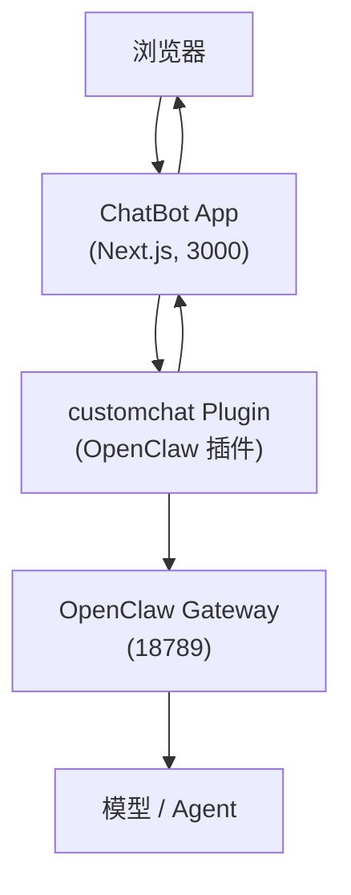

# ChatBot 部署与使用指南

这份文档主要回答 4 件事：

1. 这个项目怎么部署
2. Docker 部署和本地启动有什么区别
3. 角色聊天有什么特性，怎么用
4. 群组聊天有什么特性，怎么用

如需查看底层架构和模块说明，可继续阅读 [project-overview.md](./project-overview.md) 和 [architecture.md](./architecture.md)。

这份文档现在按“约定优于配置”来写：

- plugin 到 app 默认走 `ws://127.0.0.1:3001/api/customchat/socket`
- bridge host 固定为 `127.0.0.1`，path 固定为 `/api/customchat/socket`
- 只有 bridge port 允许覆盖；覆盖时需要同时改 app `.env` 和 `openclaw.json`
- provider ingress path 固定为 `/customchat/inbound`
- 群组 watchdog 使用内置默认值，不作为常规部署项暴露

---

## 一、项目由哪些部分组成

这个项目不是单独一个网页应用，而是一条完整链路：



其中：

- `ChatBot App` 负责网页、登录、消息存储、SSE 推送、附件上传下载
- `customchat Plugin` 负责把网页消息接入 OpenClaw，并把 Gateway 事件回推给 app
- `OpenClaw Gateway` 负责真正的 agent run、工具调用、模型推理

所以无论你选择 Docker 还是本地启动，**app 只是其中一环**。  
如果 OpenClaw Gateway 和 `customchat` 插件没有正常运行，网页能打开，但聊天不会真正工作。

---

## 二、部署方式总览

目前推荐两种方式：

| 方式 | 适合场景 | 启动命令 | 特点 |
|---|---|---|---|
| Docker 部署 | 长期运行、稳定使用、机器重启后自动恢复 | `docker compose up --build -d` | 更接近“服务部署” |
| 本地启动 | 日常开发、调试、改代码后立即生效 | `npm install` + `npm run dev` | 更接近“开发模式” |

如果你想本地跑生产模式，也可以使用：

```bash
npm install
npm run build
npm run start
```

这会比 `npm run dev` 更接近 Docker 内的运行方式，但依然不是系统守护进程。

---

## 三、OpenClaw 插件安装

无论你使用 Docker 还是本地启动 app，`customchat` 插件都需要先安装到 OpenClaw。

### 1. 推荐方式：使用软链接安装

推荐在项目根目录执行：

```bash
openclaw plugins install --link ./plugins/customchat
```

这里的 `--link` 可以理解为“软链接安装”或“symlink 安装”。  
推荐它的原因是：

- OpenClaw 使用的是你当前仓库里的插件目录
- 你更新 `plugins/customchat/` 下的代码后，不需要重新复制插件目录
- 对开发、调试、迭代插件逻辑非常方便
- 避免项目源码和 OpenClaw 插件目录各存一份，减少版本不一致

### 2. 为什么更推荐 `--link`

如果不用 `--link`，很多插件管理器会做“复制安装”：

- 当时能装上
- 但后续你改了仓库里的插件代码，OpenClaw 实际用的可能还是旧副本
- 这会导致“代码明明改了，但运行结果没变”的错觉

所以对于这个项目，**软链接安装通常是最省心的方式**。

### 3. 安装后建议检查

安装完成后执行：

```bash
openclaw plugins list
```

确认 `customchat` 指向的是当前项目里的插件目录，而不是某个旧副本。

### 4. 安装完插件后还要补哪些配置

安装插件本身还不够，通常还要在 OpenClaw 的配置文件里补上 `channels.customchat`。

配置文件位置通常是：

```text
~/.openclaw/openclaw.json
```

建议至少补这一段：

```json
{
  "channels": {
    "customchat": {
      "authToken": "change-me-customchat-token",
      "bridgePort": 3001,
      "debug": false
    }
  }
}
```

#### 字段说明

- `authToken`
  customchat 的统一鉴权 token，同时用于 app 调插件 ingress 和插件连接 app bridge。
- `bridgePort`
  插件回连 app bridge 时使用的端口。默认 `3001`，只有你显式改了 app 侧 bridge 端口时才需要一起改。
- `debug`
  是否开启插件 debug 日志。

#### 哪些是必须的

- `authToken`：必须
- `bridgePort`：可选，默认 `3001`
- `debug`：可选，默认关闭

如果缺少 `authToken`，插件无法正常接 ingress 或回推消息。

### 5. 配置原则

当前实现里，插件侧以 `~/.openclaw/openclaw.json` 的 `channels.customchat` 作为唯一真源。  
普通部署不要再额外给 OpenClaw 插件配置环境变量：

- `CUSTOMCHAT_AUTH_TOKEN`

这些不再是常规部署入口；如果你在文档或旧脚本里看到 `CUSTOMCHAT_BASE_URL`，那已经是旧口径。

### 6. 插件更新后要不要重启

通常需要重启 OpenClaw Gateway，让插件重新加载：

```bash
systemctl --user restart openclaw-gateway
```

如果你的 OpenClaw 不是通过 systemd user service 管理，就按你自己的 Gateway 启动方式重启。

### 7. 插件安装和 app 部署的关系

这里要特别注意：

- Docker 只负责运行 app
- `customchat` 插件是安装在 OpenClaw 侧的
- 它不是 Docker 容器里自动帮你装上的

也就是说，即使你已经 `docker compose up -d`，如果 OpenClaw 侧没安装好插件，聊天链路依然不会通。

---

## 四、Docker 部署

### 1. 适用场景

Docker 更适合下面这些情况：

- 你想把服务长期挂着
- 你希望机器重启后服务自动恢复
- 你不想让 Node 版本、依赖环境、宿主机差异影响运行结果
- 你希望部署方式更固定，排查路径更统一

### 2. 启动前准备

确保以下条件成立：

- 项目根目录已经有 `.env`
- Docker 已安装
- OpenClaw Gateway 已在宿主机正常运行
- OpenClaw 已安装并启用 `plugins/customchat`

常规部署时，app 侧真正需要关心的核心环境变量只有：

- `APP_SESSION_SECRET`
- `APP_ADMIN_EMAIL`
- `APP_ADMIN_PASSWORD`
- `CUSTOMCHAT_AUTH_TOKEN`
- `CUSTOMCHAT_BRIDGE_PORT`（仅当你不用默认 `3001` 时）

其中：

- `APP_BASE_URL` 有合理默认值，通常不需要改
- `CUSTOMCHAT_AUTH_TOKEN` 要与 `openclaw.json` 里的 `channels.customchat.authToken` 保持一致
- 如果你改了 `CUSTOMCHAT_BRIDGE_PORT`，要把 `openclaw.json` 里的 `channels.customchat.bridgePort` 改成相同值
- 如果你想看插件详细日志，直接把 `openclaw.json` 里的 `channels.customchat.debug` 设为 `true`

### 3. 启动命令

在项目根目录执行：

```bash
docker compose up --build -d
```

查看日志：

```bash
docker compose logs -f web
```

停止：

```bash
docker compose down
```

### 4. Docker 方式的优点

- 更稳，适合持续运行
- 环境固定，迁移到另一台机器更容易复现
- 当前项目已配置 `restart: unless-stopped`，更适合常驻
- 当前 Compose 已处理好 `host` 网络模式，方便 app 访问宿主机上的 OpenClaw Gateway

### 5. Docker 方式的缺点

- 启动和调试比本地模式稍重
- 改代码后通常要重新构建或重启容器
- 排查问题时要同时看容器日志和宿主机上的 OpenClaw 日志

---

## 五、本地启动

### 1. 适用场景

本地启动更适合下面这些情况：

- 你正在开发或调试功能
- 你想改完代码立刻看到结果
- 你希望直接在终端里看日志
- 你不想在调试时绕一层 Docker

### 2. 启动命令

开发模式：

```bash
npm install
npm run dev
```

生产模式：

```bash
npm install
npm run build
npm run start
```

### 3. 本地启动时 `.env` 怎么生效

根目录启动时，Next.js 会自动读取项目根目录的 `.env`。  
也就是说，只要 `.env` 已经在项目里，通常不需要手动 `export`。

### 4. 本地方式的优点

- 改代码后热更新，反馈最快
- 日志更直接，调试最方便
- 不需要容器，链路更短
- 对“同机部署 OpenClaw + app”的场景很友好

### 5. 本地方式的缺点

- `npm run dev` 只是当前终端里的前台进程
- 电脑重启、休眠、关终端、断开 SSH 后，服务会停
- 不适合长期守护
- 与生产环境并不完全等价

### 6. 本地启动时要注意的事

1. 不要和 Docker 里的 `web` 同时运行
原因：会抢占 `3000` 和 `3001` 端口。

2. OpenClaw 插件回调地址仍然按项目约定：

```text
ws://127.0.0.1:3001/api/customchat/socket
```

这里只有 `port` 允许覆盖；如果你把 app `.env` 改成了 `CUSTOMCHAT_BRIDGE_PORT=4001`，也要同步把 `openclaw.json` 改成 `"bridgePort": 4001`。

3. 如果你只是想临时看生产行为，优先考虑：

```bash
npm run build
npm run start
```

而不是长期使用 `npm run dev`。

---

## 六、Docker 和本地启动怎么选

可以直接按这个原则判断：

| 你的目标 | 推荐方式 |
|---|---|
| 我想稳定挂着，日常直接用 | Docker |
| 我想改代码、调试、看日志 | 本地 `npm run dev` |
| 我想验证接近生产的行为，但先不做系统服务 | 本地 `npm run start` |

一句话总结：

- **Docker** 更像“部署”
- **本地启动** 更像“开发”

---

## 七、角色聊天是什么

角色聊天可以理解为“一对一面板聊天”：

- 一个面板绑定一个 agent
- 用户消息直接发给这个 agent
- 适合单角色长期对话
- 适合普通问答、助手协作、单一职责工作流

### 角色聊天的特点

- 路由简单，没有多人协作分发
- 一个面板通常对应一个会话目标
- 更容易理解，也更适合日常使用
- 出问题时排查成本更低

### 角色聊天怎么用

1. 登录系统
2. 创建或选择一个角色面板
3. 在输入框直接发消息
4. 等待 agent 回复
5. 如有附件，可直接上传后发送

### 适合什么时候用

- 你只需要一个 agent 回答
- 你希望对话上下文稳定连续
- 你不需要角色分工和协作

---

## 八、群组聊天是什么

群组聊天可以理解为“多角色协作面板”：

- 一个群组里可以有多个角色
- 每个群角色都是独立执行单元
- 每个群角色有自己的 provider session
- 消息会根据 `@角色` 或 leader 路由规则分发给目标角色

更详细的技术设计见 [group-technical-design.md](./group-technical-design.md)。

### 群组聊天的核心特性

#### 1. 多角色协作

群组里的每个角色都可以处理自己负责的任务。  
例如：`产品经理`、`分析师`、`撰稿人`、`Leader` 分工协作。

#### 2. 显式 `@角色` 路由

当消息里带有 `@角色名` 时，系统会把消息路由到对应角色。

#### 3. Leader 兜底

没有显式 `@` 时，消息通常会优先转给 leader。  
leader 可以继续分派任务、催办成员、汇总阶段结果。

#### 4. 每个角色独立 busy/idle

某个角色正在处理任务时，它会处于 `busy` 状态。  
此时发给它的新消息不会丢，而是进入它自己的等待队列。

#### 5. 群任务状态

群组整体会维护任务状态：

- `idle`
- `in_progress`
- `completed`

这里不是“用户一发消息就自动进入进行中”。  
默认情况下，群任务状态主要由 leader 在合适时机显式输出状态标记来控制：

- 输出 `[TASK_IN_PROGRESS]`：把群状态切到 `in_progress`
- 输出 `[TASK_COMPLETED]`：把群状态切到 `completed`
- 不输出标记：群状态保持不变

另外，用户也可以直接点击群聊头部的状态标签，手动切到：

- `空闲`
- `进行中`
- `已完成`

这个手动切换只是临时改当前值，不会抢走 leader 的控制权；leader 后续再次输出状态标记时，仍然会继续覆盖群状态。

#### 6. 超时提醒与恢复

如果群任务长时间没有推进，系统会做两类事情：

- 对单个忙碌太久的角色做 watchdog 检查
- 当全员 idle 但任务仍未完成时，自动提醒 leader 催办和汇总，并明确要求它输出 `[TASK_IN_PROGRESS]` 或 `[TASK_COMPLETED]`

### 群组聊天怎么用

#### 方式一：直接向 leader 发起任务

适合你希望 leader 统筹全局的场景：

1. 进入群组面板
2. 直接输入任务目标
3. leader 收到后再决定如何分派给其他角色

#### 方式二：显式 `@角色`

适合你明确知道谁该处理某一步：

```text
@分析师 请先整理武汉本周天气和出行建议
@撰稿人 根据分析结果写一版公众号文案
```

#### 方式三：让 leader 汇总并结束

当各角色都完成后，leader 可以总结结果。  
如果任务确实完成，leader 应显式输出：

```text
[TASK_COMPLETED]
```

这样群任务状态才会切到 `completed`。

如果任务还在持续推进、但当前需要继续协作，也应由 leader 显式输出：

```text
[TASK_IN_PROGRESS]
```

这样群任务状态会保持或切回 `in_progress`。

### 群组聊天适合什么时候用

- 你希望多个角色分工协作
- 你希望某个 leader 负责汇总和调度
- 你要处理多阶段、多角色参与的任务
- 你接受比单角色聊天更复杂的状态流转

### 群组聊天需要注意什么

1. 群组不是“多人同时随便聊”
它更像“多 agent 协作工作流”。

2. `@角色` 很重要
你越明确指定目标角色，路由越可控。

3. 某个角色忙碌时会排队
这不是故障，而是设计行为。

4. 任务完成最好由 leader 明确收口
否则群任务可能会一直停留在 `in_progress`。

5. 用户手动切状态只是临时纠偏
它不会永久覆盖 leader；后续 leader 再次输出状态标记时，群状态仍会继续变化。

---

## 九、推荐实践

### 如果你只是想先稳定用起来

优先选择 Docker：

```bash
docker compose up --build -d
```

适合长期运行，机器重启后也更容易恢复。

### 如果你正在开发功能

优先选择本地启动：

```bash
npm install
npm run dev
```

适合看日志、调试接口、快速改动 UI 和聊天逻辑。

### 如果你先从使用角度入门

建议顺序是：

1. 先用角色聊天熟悉基本链路
2. 再用群组聊天理解 `@角色`、leader、busy/idle、任务完成状态

---

## 十、常见问题

### 1. 只启动 app，不启动 OpenClaw，可以聊天吗

通常不行。  
页面可以打开，但消息无法真正进入 agent run 链路。

### 2. 本地启动和 Docker 启动能同时开吗

不建议。  
默认都会占用 `3000` 和 `3001` 端口。

### 3. 本地启动后重启电脑会自动恢复吗

不会。  
`npm run dev` 和普通 `npm run start` 都只是当前进程，不是系统守护服务。

### 4. 群组聊天为什么有时回复没立刻出来

可能不是故障，而是目标角色正处于 `busy` 状态，新消息进入了该角色自己的等待队列。

---

## 十一、相关文档

- [README.md](../README.md)
- [project-overview.md](./project-overview.md)
- [architecture.md](./architecture.md)
- [group-technical-design.md](./group-technical-design.md)
- [troubleshooting.md](./troubleshooting.md)
