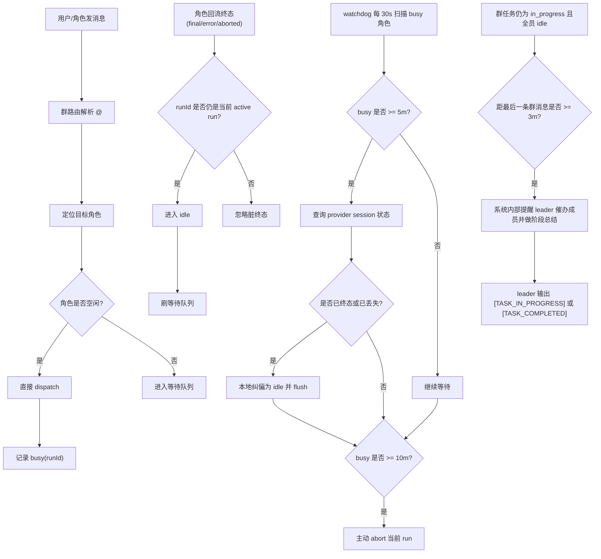

# Group Technical Design

## Overview

群组模式基于“每个群角色一个独立 session”的模型运行：

- 群组 panel 负责承载消息与角色列表
- 每个群角色收到消息时，都会投递到自己的 provider session
- 群角色忙碌时，新消息进入该角色自己的等待队列
- 群角色完成后，才会继续刷出队列

## AI Group Management

当前群组体系还额外提供了一条“角色可调用的管理能力”，但它和普通群消息路由是两套边界明确的机制：

- 角色侧通过 `customchat` 插件内置的 `manage_group` tool 发起群组管理操作
- tool 调用通过现有 app bridge WebSocket 回到 app 内部 store 执行
- 这条能力默认对前端隐藏，用户主要看到的是最终自然语言结果

当前 `manage_group` 的职责范围仅限于：

- 创建群组
- 查询现有群组
- 查询可用 agent
- 给群组添加角色
- 更新角色信息
- 设置或取消 leader
- 删除群组角色

它**不负责**下面这些运行时行为：

- 普通群消息的 `@角色` 路由
- leader 兜底转发
- 群任务状态控制
- 群成员之间的正文消息投递

这些仍然由现有群聊运行时负责，也就是本文后面描述的 Routing Model / Task State / Busy Queue / Watchdog 机制。

换句话说，当前设计里：

- `manage_group` 只负责“改群结构”
- 群聊 runtime 只负责“跑群协作”

这样做的原因是先把“管理平面”和“对话平面”拆开，避免 AI 在同一个输出通道里既管建群又管正文路由，导致协议边界变得混乱。

## Routing Model

路由规则：

1. 有显式 `@角色`
   - 转发给被 `@` 的目标角色
2. 无显式 `@`
   - 用户消息默认转发给 leader
   - 群角色消息默认转发给 leader
   - 如果发送者本身就是 leader，则不再转发给自己

## Task State

每个群组 panel 额外维护一个任务状态：

- `idle`
- `in_progress`
- `completed`

状态切换规则：

1. 用户向群里发消息
   - 只负责路由，不会自动改群状态
2. 只有 leader 的终态回复（`event:chat state=final`）才会触发自动状态切换
3. leader 回复末尾单独输出 `[TASK_IN_PROGRESS]`
   - app 才会把群状态切到 `in_progress`
4. leader 回复末尾单独输出 `[TASK_COMPLETED]`
   - app 才会把群状态切到 `completed`
5. leader 回复没有状态标记
   - 群状态保持不变

这意味着群任务状态由 leader 显式控制，而不是由“用户一发消息”或 busy/idle 自动推断。

leader 的首轮注入提示里会明确说明：

- 任务已经正式开始推进，或判断接下来仍需继续协作时，输出 `[TASK_IN_PROGRESS]`
- 任务真正完成时，输出 `[TASK_COMPLETED]`
- 小问题、闲聊、补充说明不输出任何状态标记
- 同一条回复里不能同时输出两个标记

此外，用户也可以在群聊头部手动把群状态切到 `idle / in_progress / completed`。
这个手动操作只修改“当前状态值”，不会屏蔽 leader 的后续控制；leader 之后再次输出状态标记时，仍然会继续覆盖群状态。

## Busy / Idle State

每个群角色在 app 内维护一条执行记录：

- `runId`
- `agentId`
- `startedAt`
- `lastInspectionAt`
- `abortRequestedAt`

状态切换规则：

1. dispatch 成功
   - 角色进入 `busy`
2. 收到该角色当前 `runId` 的 `final / error / aborted`
   - 角色进入 `idle`
   - 刷出该角色等待队列
3. 如果回流事件的 `runId` 与当前 active run 不匹配
   - 忽略该终态事件
   - 不会错误释放执行权

## Timeout Recovery

为防止某个角色卡死导致后续消息长期排队，群路由内置低成本 watchdog。

实现策略：

- 使用单个 `setInterval`
- 每 30 秒扫描一次当前 `busy` 角色
- 不为每个角色单独起轮询器
- 当前规模下，这是最低实现成本的方案

可调环境变量：

- `GROUP_ROLE_WATCHDOG_INTERVAL_MS`：扫描周期，默认 `30000`
- `GROUP_ROLE_BUSY_INSPECT_AFTER_MS`：session 校验阈值，默认 `300000`
- `GROUP_ROLE_BUSY_ABORT_AFTER_MS`：强制 abort 阈值，默认 `600000`

超时行为：

1. 角色进入 `busy` 后满 5 分钟仍未回到 `idle`
   - app 调 provider `GET /customchat/session`
   - 校验该 session 是否仍存在，或对应 run 是否已终态
2. 如果 session 已不存在，或 run 已终态
   - app 直接纠偏，把该角色本地状态恢复为 `idle`
   - 然后刷出等待队列
3. 如果 10 分钟仍未 `idle`
   - app 主动调用 provider `POST /customchat/abort`
   - 请求终止该角色当前 run

## Task Reminder

除了角色级 busy watchdog，群组还增加了任务级 reminder：

- 当群状态仍是 `in_progress`
- 且当前所有群角色都已经回到 `idle`
- 且距离最后一条群消息已经超过 3 分钟

app 会自动向 leader 发一条内部提醒，要求它：

- 催促其他成员汇报任务/进度
- 基于已收到的进度给出阶段总结
- 决定是否继续分派下一步
- 如果任务仍在推进，输出 `[TASK_IN_PROGRESS]`
- 只有在任务真正完成时输出 `[TASK_COMPLETED]`

实现上直接复用现有 watchdog 定时器，不单独起新的轮询器。这是当前最低成本方案。

## Flow

## TODO

### 升级为结构化路由 Tool

当前群内转发目标和任务状态都放在 assistant 回复末尾的文本 footer 控制块里，再由 app 解析 `@角色名` 与 `[TASK_IN_PROGRESS] / [TASK_COMPLETED]`。

这个方案实现成本低，但本质仍是“自然语言正文 + 文本控制协议”复用同一输出通道，后续如果继续扩展更多控制字段，协议会越来越脆弱。

后续更推荐在 `customchat` 插件内注册一个专用的群路由控制 tool，例如 `group_route`，让角色用结构化参数显式上报：

- `targets`：下一跳角色列表
- `taskState`：`idle / in_progress / completed`
- `handoffReason`：可选，说明为什么转交给这些角色

落地后，聊天正文只负责展示，群路由和任务状态只消费 tool 参数，前端默认隐藏这类控制 tool 的调用细节，从架构上避免 footer 文本协议冲突。

### 补齐群管理 Tool 的后续扩展

当前 `manage_group` 已经可用于“创建群组 + 管理成员/leader”，但仍有几项后续可扩展能力：

- 增加按 `panelId / panelTitle` 读取单个群详情的精确查询
- 增加删除整个群组的结构化 action
- 增加更细粒度的权限与确认策略，避免角色误改群结构
- 后续如果接入结构化 `group_route`，需要继续保持“群管理 tool”和“群路由 tool”职责分离
