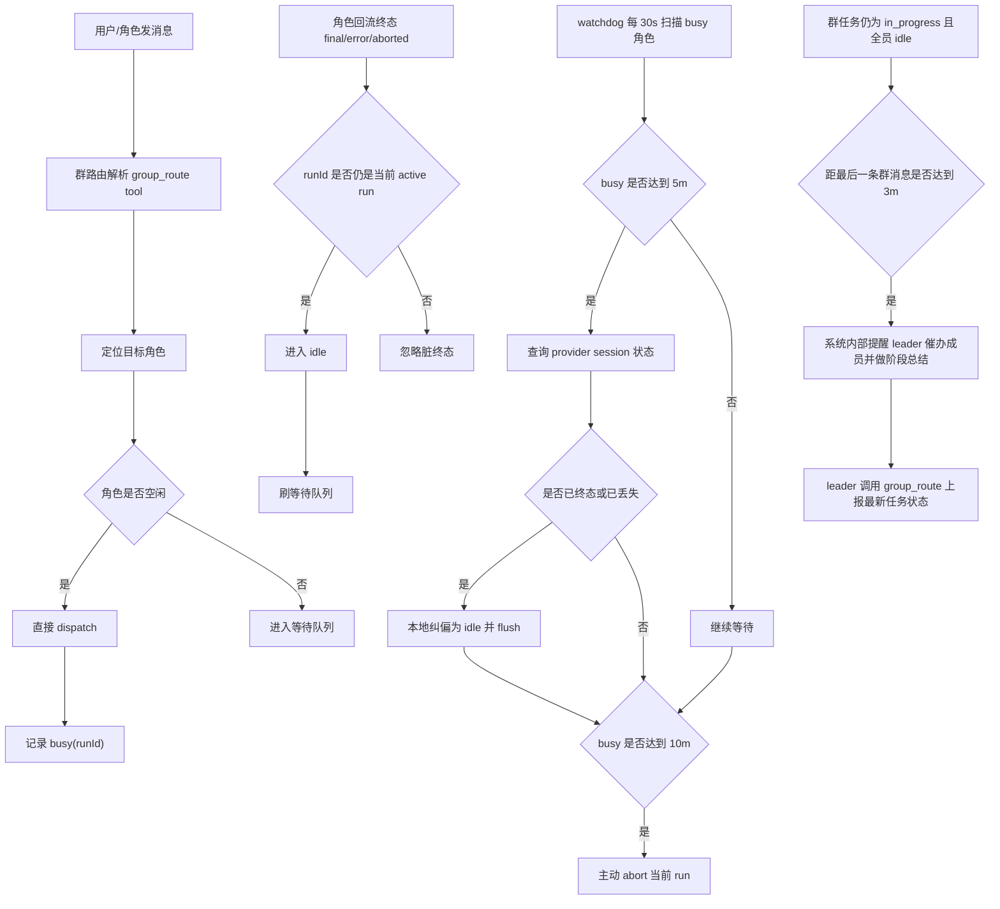

# Group Technical Design

## Overview

群组模式基于“每个群角色一个独立 session”的模型运行：

- 群组 panel 负责承载消息与角色列表
- 每个群角色收到消息时，都会投递到自己的 provider session
- 群角色忙碌时，新消息进入该角色自己的等待队列
- 群角色完成后，才会继续刷出队列

### OpenClaw Session Rollover Note

需要特别注意：OpenClaw 默认会对 session 做自动换新。

- 如果没有显式配置 `session.reset` / `session.resetByType` / `session.resetByChannel`
- OpenClaw 默认会按 `daily` 模式处理 session
- 默认换新边界是 **Gateway 主机本地时间凌晨 4:00**
- 这会导致同一个群角色的 `sessionKey` 在 4:00 之后的下一条消息到来时切到新的 `sessionId`

对普通聊天来说，这个默认策略未必有问题；但对“群角色长期协作”的场景来说，它会表现成：

- 角色前一天的协作上下文突然丢失
- leader / 成员第二天继续工作时，像是“重新开了一个新会话”

因此，群聊部署时更推荐把 OpenClaw 的 session reset 策略改成 `idle`，例如：

```json
{
  "session": {
    "reset": { "mode": "idle", "idleMinutes": 43200 }
  }
}
```

这表示：

- 不再按每天 4:00 固定切新 session
- 改为“连续 30 天无活动”才切新的 `sessionId`
- 只要期间有新消息，空闲窗口就会重新开始计算

如果希望只调整群聊，不影响 direct 会话，也可以进一步改成 `resetByType.group` 做定向覆盖。

## AI Group Management

当前群组体系还额外提供了一条“角色可调用的管理能力”，但它和普通群消息路由是两套边界明确的机制：

- 角色侧通过 `customchat` 插件内置的 `manage_group` tool 发起群组管理操作
- tool 调用通过现有 app bridge WebSocket 回到 app 内部 store 执行
- 这条能力默认对前端隐藏，用户主要看到的是最终自然语言结果

当前 `manage_group` 的职责范围包括：

- 创建群组
- 查询现有群组
- 查询单个群的任务状态与详情
- 查询可用 agent
- 删除群组
- 向群里发送一条“用户消息”
- 给群组添加角色
- 更新角色信息
- 设置或取消 leader
- 删除群组角色

它**不负责**下面这些运行时行为：

- 普通群消息的 `@角色` 路由
- leader 兜底转发
- 群任务状态控制
- 群成员之间的正文消息投递

这些仍然由现有群聊运行时负责，也就是本文后面描述的 Routing Model / Task State / Busy Queue / Watchdog 机制。

换句话说，当前设计里：

- `manage_group` 只负责“改群结构”
- 群聊 runtime 只负责“跑群协作”

这样做的原因是先把“管理平面”和“对话平面”拆开，避免 AI 在同一个输出通道里既管建群又管正文路由，导致协议边界变得混乱。

## AI Group Plan

除了 `manage_group`，当前群组体系还提供一条独立的“群 Plan 管理能力”：

- 角色侧通过 `customchat` 插件内置的 `manage_group_plan` tool 发起 Plan 读写
- tool 调用同样复用现有 app bridge WebSocket，不引入新的监听端口
- Plan 直接作为 group panel 的一个强绑定字段持久化入库
- Web 侧通过群聊头部 `... -> 查看 Plan` 展示当前 Plan

当前 `manage_group_plan` 的职责范围包括：

- 查询某个群当前的 Plan
- 更新某个群的 Plan 摘要和条目
- 清空某个群的 Plan

Plan 的目标不是替代群消息，而是提供一份**面向用户展示的简洁进度视图**。因此它有几个明确约束：

- 内容简洁，不抄整段讨论原文
- 重点写“当前进展、关键事项、阻塞项”
- 条目状态使用结构化枚举：`pending / in_progress / done / blocked`
- 与 `taskState` 分离：`taskState` 是机器态，Plan 是人读摘要

默认约定里：

- 所有 agent 都可以调用 `manage_group_plan`
- 只有 leader 的群首轮注入里会被明确要求维护 Plan
- 普通成员对这条机制无感，不会在注入中被要求更新 Plan

这样做的原因是：

- 角色聊天或单角色会话里，仍然可能需要查询某个群的最新进度
- leader 负责默认维护，但不把 Plan 能力硬编码死在“只有 leader 才能调用”的权限模型里
- 用户查看时，不需要翻群消息，就能直接看到当前协作进展

## AI Group Memory

除了 Plan，群组体系还提供了一块**群共享记忆板**，用于在成员之间低成本共享核心状态信息：

- 角色侧通过 `customchat` 插件内置的 `manage_group_memory` tool 读写记忆
- 每个角色只维护自己的那一块记忆，但所有人都可以读取全部成员的记忆
- 记忆内容要求精简，只记录核心信息：负责的文件路径、当前任务进度、当前遇到的问题等
- 记忆持久化到 group panel 的 `groupMemory` 字段（`roleId → { roleTitle, content, updatedAt }`）

当前 `manage_group_memory` 的职责范围：

- `get_memory`：读取当前群所有成员的记忆
- `update_my_memory`：更新自己的记忆条目
- `clear_my_memory`：清空自己的记忆条目

**记忆板的目标**：让群内消息保持简洁，成员不必在每条消息里重复背景信息，核心上下文通过记忆板共享。成员写好自己的记忆后，其他人随时可以主动调用 `manage_group_memory` 查看。

与 Plan 的区别：

- Plan 是面向用户的进度摘要，由 leader 维护，Web 端可直接查看
- 记忆板是面向角色协作的技术上下文，每人各维护自己的部分，不对用户直接展示

## Routing Model

路由基于 `group_route` tool 的结构化调用，不再依赖正文末尾的文本 footer。详见 [结构化路由](#structured-routing) 章节。

路由规则：

1. 角色调用 `group_route(targets=[...])` 显式指定下一跳
   - 转发给 `targets` 里列出的角色（排除发送者自身）
2. `targets` 为空数组
   - 不转发，该轮对话在此角色终止
3. 未调用 `group_route`（角色忘记调用）
   - 用户消息兜底转发给 leader
   - 群角色消息不转发（避免死循环）

### 保留文本 @mention 解析的两处场景

虽然角色回复侧的 footer 文本解析已完全移除，但以下两处仍保留 `parseTrailingMentions` / `extractInstructionText`，原因各不相同：

**1. `lib/group-router.ts` — 用户消息路由**

用户在输入框手动输入或选择 `@角色名` 发送消息时，正文里包含 `@mention`。用户不会调用 `group_route` tool，这条路径本身就是基于文本的，因此 `routeMessage` 里保留文本解析作为用户消息的路由依据。

**2. `lib/group-message.ts` — `manage_group` 工具发消息**

`manage_group(action="message")` 允许 agent 以"用户消息"的身份向群内发一条消息，并在正文中用 `@角色名` 指定接收者。这是一条独立的管理通道，不经过角色回复的 ingest 流程，因此同样保留文本解析来决定路由目标。

## Task State

每个群组 panel 额外维护一个任务状态，共六种：

| 状态 | 标识符 | 含义 |
|------|--------|------|
| 空闲 | `idle` | 无任务进行中，群处于待命状态 |
| 执行中 | `in_progress` | 成员正在推进任务 |
| 等待输入 | `waiting_input` | 需要用户提供更多信息才能继续 |
| 被阻塞 | `blocked` | 遇到无法自行解决的障碍，需要外部介入 |
| 等待审核 | `pending_review` | 阶段性产出已完成，等待用户确认审核 |
| 已完成 | `completed` | 任务整体完成 |

状态切换规则：

1. 用户向群里发消息
   - 只负责路由，不会自动改群状态
2. 只有 leader 的终态回复（`event:chat state=final`）才会触发自动状态切换
3. leader 在调用 `group_route` 时通过 `taskState` 参数上报状态，app 消费后更新：
   - `taskState: “in_progress”` → `in_progress`
   - `taskState: “waiting_input”` → `waiting_input`
   - `taskState: “blocked”` → `blocked`
   - `taskState: “pending_review”` → `pending_review`
   - `taskState: “completed”` → `completed`
4. `group_route` 未携带 `taskState`，或本轮未调用 `group_route`
   - 群状态保持不变
5. 同一条回复里只能上报一个 `taskState`

这意味着群任务状态由 leader 显式控制，而不是由”用户一发消息”或 busy/idle 自动推断。

leader 的首轮注入提示里会明确说明各状态的适用场景，以及不上报任何状态的情形（小问题、闲聊、补充说明等）。

此外，用户也可以在群聊头部手动切换到任意状态。手动操作只修改”当前状态值”，不会屏蔽 leader 的后续控制；leader 之后再次通过 `group_route` 上报状态时，仍然会继续覆盖群状态。

## Structured Routing

### 背景

旧方案将路由目标（`@角色名`）和任务状态（`[TASK_IN_PROGRESS]` 等文本标记）混在 assistant 正文末尾的 footer 控制块里，由 app 做文本解析。这种方式实现成本低，但本质是”自然语言正文”与”控制协议”共用同一输出通道，存在以下问题：

- 模型输出格式偏移（多空行、标点变化）即导致解析失败
- 控制字段越多，协议越脆弱
- 正文与控制信号无法干净分离

### 新方案

在 `customchat` 插件内注册专用的 `group_route` tool，让角色通过结构化参数显式上报路由意图：

```
group_route({
  panelId: “当前群组 ID”,
  targets: [“rd”, “ui”],        // 下一跳角色名列表，空数组 = 不转发
  taskState: “in_progress”      // 可选，只有 leader 才需要传
})
```

正文只负责展示内容，路由和任务状态完全通过 tool 参数传递。

### 实现机制

tool 的 `execute` 执行时，直接通过 `sendPortalAppRpc(“group_route.declare”, {...})` 将路由意图 push 给 app，不依赖 `runtimeSteps`（runtimeSteps 受 `defaultVerbose` 设置影响，可能为空）。

app 收到后以 `runId` 为键，将路由意图存入内存（`pendingRouteIntents` Map）。tool 立即返回 ok，agent 继续执行。

之后 `state=final` 到达 ingest 时，用 `runId` 查询并消费 pending intent：有 → 使用结构化信号；无 → 不路由。

**tool 执行时如何拿到 runId**：`execute(toolCallId, params)` 签名里没有 runId，通过 plugin-runtime 暴露的 `getRunIdByToolCallId(toolCallId)` 辅助函数反查（`trackedRun.toolCallArgs` 已按 toolCallId 缓存了参数，反向遍历 `trackedRuns` Map 即可定位）。

### 数据流

```mermaid
flowchart TD
    A[“角色回复完成，调用 group_route tool”] --> B[“execute 触发”]
    B --> C[“getRunIdByToolCallId 反查 runId”]
    C --> D[“sendPortalAppRpc group_route.declare”]
    D --> E[“app 写入 pendingRouteIntents Map\nkey=runId”]
    E --> F[“tool 返回 ok，agent 继续”]

    G[“state=final 到达 ingest”] --> H[“consumeRouteIntent(runId)”]
    H --> I{“有 pending intent”}
    I -->|是| J[“targets 解析为角色 ID”]
    J --> K[“routeMessage 转发给目标角色”]
    J --> L[“taskState 写入群状态”]
    I -->|否| M[“不路由，结束”]
```

### 改动范围

| 文件 | 改动类型 |
|---|---|
| `plugins/customchat/plugin-runtime.ts` | 新增 `getRunIdByToolCallId` export |
| `plugins/customchat/group-route-tool.ts` | 新增文件，注册 `group_route` tool |
| `plugins/customchat/index.ts` | 注册新 tool |
| `lib/customchat-app-rpc.ts` | 新增 `pendingRouteIntents` Map、`group_route.declare` handler、`consumeRouteIntent` |
| `lib/customchat-ingest.ts` | 删除文本解析逻辑，改为消费 `consumeRouteIntent` |
| `lib/group-router.ts` | 不动，复用已有 `explicitMentionRoleIds` 路径 |
| `prompt/group-injection-common.md` | 删除 `@角色名` footer 说明，改为 `group_route` 指引 |
| `prompt/group-injection-leader.md` | 删除文本状态标记说明，改为 `group_route taskState` 指引 |

## Busy / Idle State

每个群角色在 app 内维护一条执行记录：

- `runId`
- `agentId`
- `startedAt`
- `lastInspectionAt`
- `abortRequestedAt`

状态切换规则：

1. dispatch 成功
   - 角色进入 `busy`
2. 收到该角色当前 `runId` 的 `final / error / aborted`
   - 角色进入 `idle`
   - 刷出该角色等待队列
3. 如果回流事件的 `runId` 与当前 active run 不匹配
   - 忽略该终态事件
   - 不会错误释放执行权

## Dispatch Injection

每次向群角色 dispatch 消息时，app 会在消息前注入上下文信息。注入分两类：

**首轮注入**（`isFirstCall=true`）：角色首次收到消息时，注入完整提示词，包括：

- 群组信息（群名、角色列表、自己的角色名）
- 消息规则（如何回复、何时 @ 他人、文档写入项目目录而非聊天框等）
- 回复原则（有结果给结果、有阻塞提问、无新信息不回复）
- 群共享记忆板使用说明（`manage_group_memory` tool 介绍）
- leader 专属职责说明（任务状态标记规则、Plan 维护职责）

**定期重注入**：角色每完成 N 次回复后，下一次 dispatch 会重新注入一次完整提示词，防止角色随对话轮次增加而漂移、不再遵守规则。重注入间隔通过 App 设置页的 `groupRoleReInjectAfterReplies` 控制（默认 `10`）。

重置规则：角色增删或 leader 变更时（`resetInitializedRoles`），该群所有角色的注入状态和计数器同步重置，下一次 dispatch 都会重新走首轮注入。

## Timeout Recovery

为防止某个角色卡死导致后续消息长期排队，群路由内置低成本 watchdog。

实现策略：

- 使用单个 `setInterval`
- 每 30 秒扫描一次当前 `busy` 角色
- 不为每个角色单独起轮询器
- 当前规模下，这是最低实现成本的方案

以下参数均通过 App 设置页调整（持久化到 app-data.json），无需修改环境变量：

- `groupRoleWatchdogIntervalMs`：扫描周期，默认 `30000` ms
- `groupRoleBusyInspectAfterMs`：session 校验阈值，默认 `300000` ms
- `groupRoleBusyAbortAfterMs`：强制 abort 阈值，默认 `600000` ms
- `groupRoleReInjectAfterReplies`：提示词重注入间隔（每隔多少次回复重新注入一次），默认 `10`

超时行为：

1. 角色进入 `busy` 后满 5 分钟仍未回到 `idle`
   - app 调 provider `GET /customchat/session`
   - 校验该 session 是否仍存在，或对应 run 是否已终态
2. 如果 session 已不存在，或 run 已终态
   - app 直接纠偏，把该角色本地状态恢复为 `idle`
   - 然后刷出等待队列
3. 如果 10 分钟仍未 `idle`
   - app 主动调用 provider `POST /customchat/abort`
   - 请求终止该角色当前 run

## Task Reminder

除了角色级 busy watchdog，群组还增加了任务级 reminder：

- 当群状态仍是 `in_progress`（注意：仅 `in_progress` 触发，其他状态不催）
- 且当前所有群角色都已经回到 `idle`
- 且距离最后一条群消息已经超过 3 分钟

app 会自动向 leader 发一条内部提醒，要求它：

- 催促其他成员汇报任务/进度
- 基于已收到的进度给出阶段总结
- 必要时更新群 Plan
- 决定是否继续分派下一步
- 根据实际情况输出一个状态标记（`[TASK_IN_PROGRESS]` / `[TASK_WAITING_INPUT]` / `[TASK_BLOCKED]` / `[TASK_PENDING_REVIEW]` / `[TASK_COMPLETED]`）

实现上直接复用现有 watchdog 定时器，不单独起新的轮询器。这是当前最低成本方案。

## Flow



## TODO

### 结构化路由 group_route（设计已完成，待实现）

设计方案详见 [Structured Routing](#structured-routing) 章节。

### 补齐群管理 Tool 的后续扩展

当前 `manage_group` 已经覆盖“创建/删除群组 + 管理成员/leader + 查群状态 + 发群消息”，后续仍可继续扩展：

- 增加更细粒度的权限与确认策略，避免角色误改群结构
- 后续如果接入结构化 `group_route`，需要继续保持“群管理 tool”和“群路由 tool”职责分离

### Group Plan 的后续扩展

当前 `manage_group_plan` 已经能满足”读 / 写 / 清空”这三类基础能力，后续可继续演进：

- 增加 Plan 历史版本或最近几次更新记录
- 增加 Web 端手动编辑入口，而不仅是只读弹窗
- 增加”仅返回自某个时间之后的 Plan 变化”的查询模式
- 在后续更复杂的协作场景里，为 Plan 增加更细的阶段标签或 owner 信息
