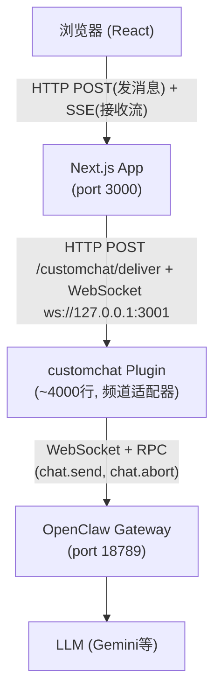
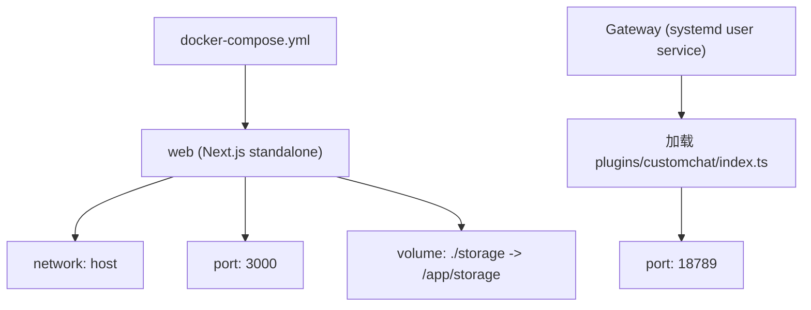
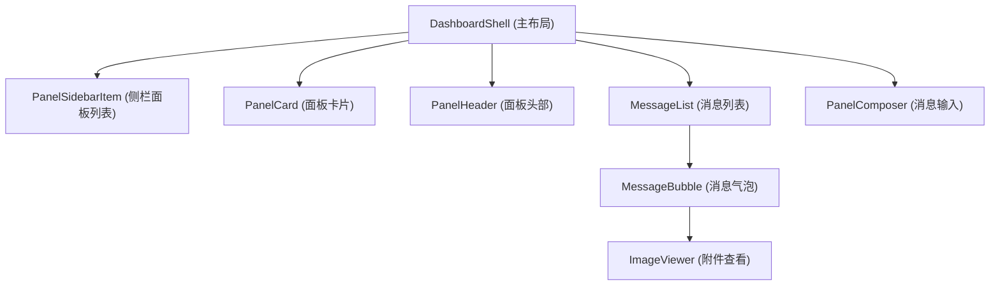

# ChatBot 项目全景分析

## 语言与运行时

| 项目 | 详情 |
|------|------|
| **主语言** | TypeScript (严格模式) |
| **运行时** | Node.js 20 |
| **文件总数** | ~44 个 `.ts`/`.tsx` 文件 |

---

## 框架栈

| 层级 | 技术 | 版本 |
|------|------|------|
| **前端框架** | React | 19 |
| **全栈框架** | Next.js (App Router) | 15.5 |
| **CSS** | Tailwind CSS | 4 |
| **Schema 校验** | Zod | 4.3 |
| **认证** | jose (JWT HS256) + bcryptjs | — |
| **实时通信** | WebSocket (ws) + SSE | — |
| **部署** | Docker (多阶段构建) | — |

---

## 四层架构

---

## 模块划分

### 1. `app/` — Next.js 路由层

| 路径 | 功能 |
|------|------|
| `page.tsx` / `login/page.tsx` | 页面入口（主面板 + 登录） |
| `api/auth/*` | 登录/登出接口 |
| `api/panels/[panelId]/*` | 面板 CRUD、消息收发、SSE 流、中止运行 |
| `api/customchat/deliver` | 接收 Plugin 推送（Bearer token 鉴权） |
| `api/customchat/webhook` | 前端发送用户消息的入口 |
| `api/agents/*` | Agent 目录 & 头像 |

### 2. `components/` — React 组件层 (~13 个文件)

| 组件 | 职责 |
|------|------|
| `dashboard-shell.tsx` | 主布局壳（面板列表 + 聊天区） |
| `message-list.tsx` | 消息列表渲染，含 `isBridgeDeliveryMessage` 过滤 |
| `message-bubble.tsx` | 单条消息气泡 |
| `panel-composer.tsx` | 消息输入框 |
| `panel-card.tsx` / `panel-sidebar-item.tsx` | 面板卡片/侧栏 |
| `login-form.tsx` | 登录表单 |
| `image-viewer.tsx` | 附件查看器 |
| `chat-helpers.tsx` / `runtime-helpers.ts` | 辅助函数 |

### 3. `lib/` — 核心业务逻辑 (~12 个文件, ~3000+ 行)

| 文件 | 职责 |
|------|------|
| **`store.ts`** | 持久化核心：JSON 文件读写 + 内存缓存 + 变更队列（防竞态）；`upsertAssistantMessage` 含 seq 序号守卫 |
| **`types.ts`** | 全部 TypeScript 类型定义 |
| **`auth.ts`** | JWT 会话管理 + bcrypt 密码验证 |
| **`customchat-ingest.ts`** | 接收 Plugin 投递 → Zod 校验 → 存储 → 发布 SSE |
| **`customchat-bridge-server.ts`** | WebSocket 桥接服务器(3001端口)，Plugin 主动连入 |
| **`customchat-events.ts`** | SSE 事件发布（内存订阅表） |
| **`customchat-provider.ts`** | 调用 Plugin HTTP 接口（删除会话/中止运行） |
| **`agents.ts`** | Agent 目录发现与缓存（5分钟 TTL） |
| **`env.ts`** | 环境变量解析 |
| **`utils.ts`** | 工具函数（ID 生成、target 解析、附件分类等） |

### 4. `plugins/customchat/` — 频道插件 (~4000 行)

- 由 OpenClaw Gateway 加载（非 Next.js 进程）
- 核心职责：
  - **入站路由**：`POST /customchat/inbound` → 创建 session → `chat.send` RPC
  - **事件跟踪**：`TrackedRun` 状态机管理流式事件
  - **出站投递**：通过 WebSocket bridge 推送到 App
  - **恢复机制**：网关重连后恢复丢失事件

---

## 数据存储

| 项目 | 详情 |
|------|------|
| **存储方式** | 单 JSON 文件 (`storage/app-data.json`) |
| **结构** | `{ users: [], panels: [], messages: [] }` |
| **缓存** | 内存缓存 + clone-on-read |
| **并发控制** | Promise 队列线性化（`mutateData()`） |
| **消息排序** | `seq` 序号守卫，丢弃乱序事件 |
| **附件** | 文件系统 (`storage/uploads/`, `storage/downloads/`) |

> ⚠️ 无数据库，适合轻量级/原型场景。数据量大时（万级消息以上）会有性能瓶颈。

---

## 数据模型

### StoredMessage

- `id`, `panelId`, `role` (user/assistant/system)
- `text`, `state` (delta/final/aborted/error), `draft`
- `runId`, `seq` (事件序号)
- `attachments[]`, `runtimeSteps[]`
- `errorMessage`, `stopReason`, `usage`

### StoredPanel

- `id`, `userId`, `agentId`
- `title`, `sessionKey` (target 标识)
- `userRoleName`, `assistantRoleName`
- `activeRunId`, `blockedRunIds`

### StoredUser

- `id`, `email`, `displayName`, `passwordHash` (bcrypt)

### StoredAttachment

- `id`, `name`, `mimeType`, `size`
- `kind` (image/audio/video/file)
- `storagePath` 或 `sourceUrl`

### StoredRuntimeStep

- `id`, `runId`, `ts`
- `stream`, `kind`, `title`, `description`, `detail`
- `status` (running/done/info/error)

---

## 安全机制

- **用户认证**：bcrypt 密码哈希 + JWT HS256（7天过期）
- **Cookie**：HttpOnly + SameSite=lax
- **Plugin 通信**：Bearer token 共享密钥
- **WebSocket**：升级时 token 校验

---

## 部署架构

- App 部署：`docker compose up --build -d`
- Plugin 部署：`systemctl --user restart openclaw-gateway`

---

## 组件层级

---

## 关键文件速查

| 用途 | 文件 |
|------|------|
| 认证 | `lib/auth.ts`, `components/login-form.tsx`, `app/api/auth/` |
| 消息投递与流式 | `lib/customchat-ingest.ts`, `lib/customchat-events.ts`, `app/api/panels/[panelId]/stream/route.ts` |
| 数据持久化 | `lib/store.ts`, `storage/app-data.json` |
| Plugin 集成 | `plugins/customchat/index.ts`, `lib/customchat-bridge-server.ts` |
| Agent 发现 | `lib/agents.ts` |
| 类型定义 | `lib/types.ts` |
| 环境配置 | `lib/env.ts`, `.env`, `docker-compose.yml` |

---

## 总结

这是一个**中等复杂度的全栈 TypeScript 应用**，架构清晰，职责分离明确：

- **前端**：React 19 + Next.js 15 App Router，Server/Client Components 混合
- **后端**：Next.js API Routes 做 BFF，无独立后端服务
- **实时**：SSE（浏览器）+ WebSocket（Plugin 桥接）双通道
- **持久化**：JSON 文件（轻量但有扩展性瓶颈）
- **插件**：~4000 行的频道适配器是最复杂的单体模块，处理 Gateway 事件流的全部状态机逻辑
