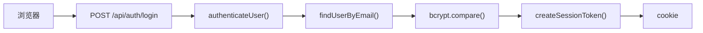
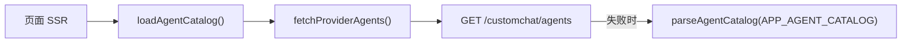
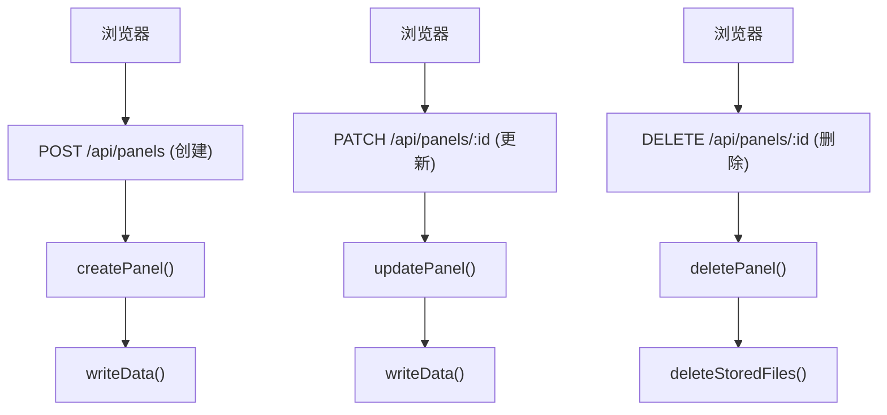
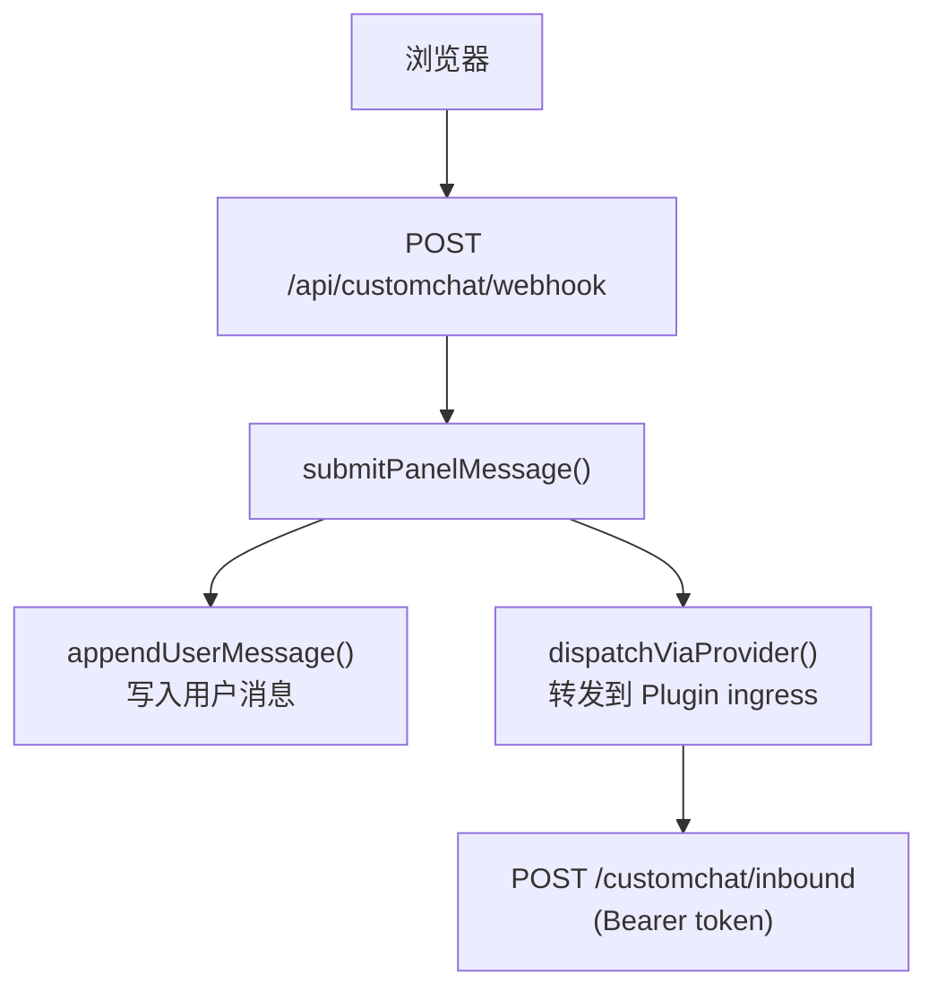
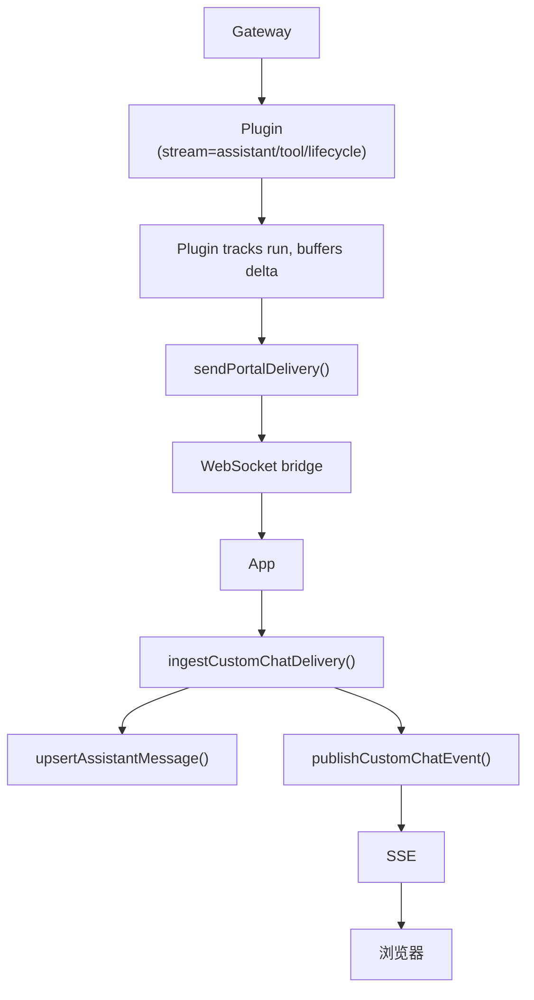
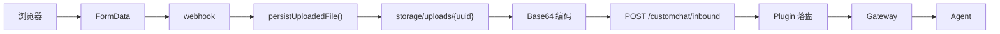
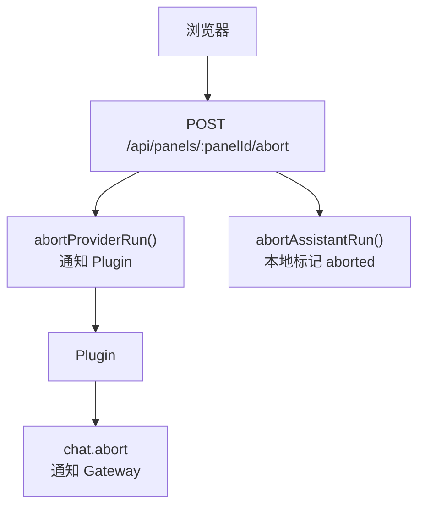
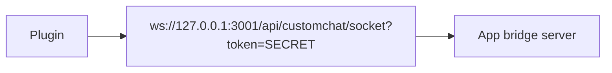
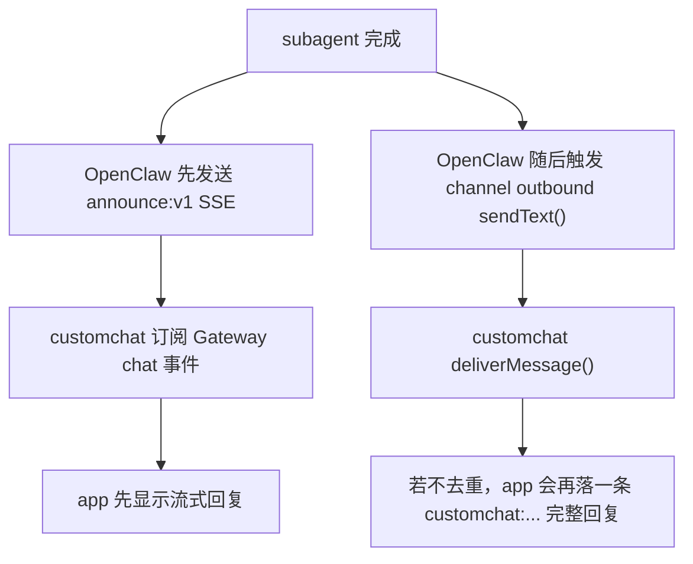
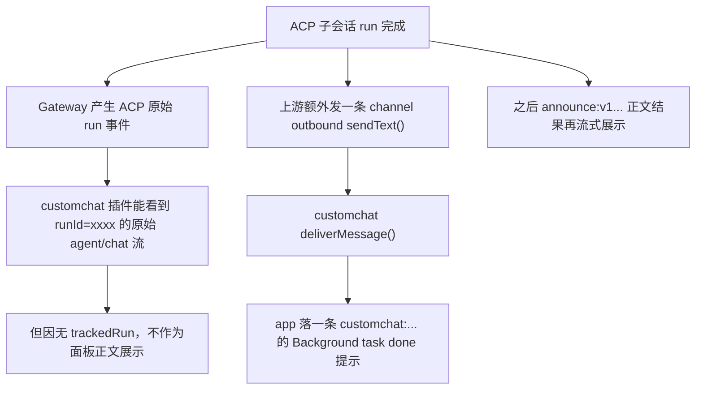

# 问题排查 SOP

本文档按功能场景列出排查步骤，涵盖从浏览器到 Gateway 的完整链路。

---

## 目录

- [0. 开启调试日志](#0-开启调试日志)
- [1. 登录异常](#1-登录异常)
- [2. Agent 列表异常](#2-agent-列表异常)
- [3. 创建/管理角色（面板）异常](#3-创建管理角色面板异常)
- [4. 发送消息异常](#4-发送消息异常)
- [5. 消息流式接收异常](#5-消息流式接收异常)
- [6. 消息气泡不显示 / 空白气泡](#6-消息气泡不显示--空白气泡)
- [7. 附件上传/显示异常](#7-附件上传显示异常)
- [8. 停止推理（Abort）异常](#8-停止推理abort异常)
- [9. WebSocket Bridge 连接异常](#9-websocket-bridge-连接异常)
- [10. Gateway 订阅异常](#10-gateway-订阅异常)
- [11. OpenClaw subagent announce 导致回复重复](#11-openclaw-subagent-announce-导致回复重复)
- [12. ACP Background Task Done 提示消息](#12-acp-background-task-done-提示消息)

---

## 0. 开启调试日志

排查问题的第一步是开启调试日志。

### App 侧（Next.js）

通过环境变量 `APP_DEBUG` 控制，**默认关闭**。

| 环境变量 | 值 | 说明 |
|---------|---|------|
| `APP_DEBUG` | `false` / 不设置 | 关闭（默认） |
| `APP_DEBUG` | `true` | 开启所有模块日志 |
| `APP_DEBUG` | `auth,store,ingest` | 只开启指定模块 |
| `APP_DEBUG_LOG_FILE` | `./storage/debug.log` | 同时写入文件（可选） |

**可选模块名**：`auth`、`store`、`ingest`、`events`、`bridge`、`provider`、`agents`、`panel-message`

**Docker 启用方式**：在 `.env` 或 `docker-compose.yml` 中设置：

```bash
# .env
APP_DEBUG=true
APP_DEBUG_LOG_FILE=./storage/debug.log
```

```bash
# 临时启用（不修改文件）
APP_DEBUG=true docker compose up -d
```

**日志格式**：

```
2026-03-18T12:00:00.000Z [DEBUG] [app:store] upsertAssistantMessage ← input {"panelId":"p1","runId":"run-1","state":"delta","textLen":"42"}
2026-03-18T12:00:00.050Z [ERROR] [app:auth] authenticateUser ✗ user not found {"email":"bad@test.com"}
```

**日志查看**：

```bash
# Docker 容器日志
docker compose logs -f web | grep '\[app:'

# 如果配了文件输出
tail -f storage/debug.log
```

**核心模块日志内容**：

| 模块 | 记录的关键信息 |
|------|-------------|
| `auth` | 登录验证结果（成功/用户不存在/密码错误）、getCurrentUser 结果 |
| `store` | upsertAssistantMessage 入参（panelId/runId/state/seq/textLen）、seq 乱序拒绝、blocked runId |
| `ingest` | 投递入参（target/runId/state/textLen/attachmentCount）、投递结果、忽略原因 |
| `events` | SSE 事件发布（runId/state/seq/listenerCount） |
| `bridge` | WebSocket 连接接受/拒绝、envelope 处理结果 |
| `provider` | HTTP 请求入参、响应状态、错误信息 |
| `agents` | provider 拉取结果（agent 数量和 ID） |
| `panel-message` | 用户消息提交（panelId/textLen/fileCount）、provider 转发结果 |

**代码位置**：[`lib/logger.ts`](../lib/logger.ts)

---

### Plugin 侧（OpenClaw Gateway）

通过 `~/.openclaw/openclaw.json` 或环境变量控制，**默认关闭**。

**方式一：配置文件**（推荐）

```json
{
  "channels": {
    "customchat": {
      "baseUrl": "http://127.0.0.1:3000",
      "sharedSecret": "...",
      "debug": true
    }
  }
}
```

**方式二：环境变量**

在 `~/.config/systemd/user/openclaw-gateway.service.d/customchat.conf` 中添加：

```ini
Environment=CUSTOMCHAT_DEBUG=true
```

然后重启：

```bash
systemctl --user daemon-reload
systemctl --user restart openclaw-gateway
```

**Plugin 日志查看**：

```bash
journalctl --user -u openclaw-gateway -f | grep '\[customchat'

# 只看调试日志
journalctl --user -u openclaw-gateway -f | grep '\[DEBUG\].*\[customchat'
```

**Plugin 日志内容**：

| 标签 | 记录的关键信息 |
|------|-------------|
| `customchat:agent-event` | Gateway agent 事件入参（stream/runId） |
| `customchat:chat-event` | Gateway chat 事件入参（runId/sessionKey/state/textLen） |
| `customchat:delivery` | 向 App 投递的 payload（target/runId/state/seq/textLen） |

---

## 1. 登录异常

### 现象

- 页面显示"登录失败"
- 登录后被重定向回 `/login`
- 页面报 401/403

### 排查流程



**Step 1：检查环境变量**

```bash
# Docker 容器内
docker compose exec web env | grep APP_ADMIN
```

确认 `APP_ADMIN_EMAIL` 和 `APP_ADMIN_PASSWORD` 正确。

**Step 2：开启 auth 调试**

```bash
APP_DEBUG=auth docker compose up -d
docker compose logs -f web | grep '\[app:auth\]'
```

观察日志：
- `authenticateUser ← input {"email":"xxx"}` — 收到请求
- `authenticateUser → user not found` — 邮箱不存在
- `authenticateUser → password mismatch` — 密码错误
- `authenticateUser → ok` — 成功

**Step 3：检查存储数据**

```bash
cat storage/app-data.json | python3 -m json.tool | grep -A3 '"email"'
```

确认用户是否存在。首次启动时 `ensureSeededAdminUser()` 会自动创建。

### 涉及代码

| 文件 | 函数 |
|------|------|
| [`lib/auth.ts`](../lib/auth.ts) | `authenticateUser()`、`createSessionToken()`、`getCurrentUser()` |
| [`lib/store.ts`](../lib/store.ts) | `findUserByEmail()`、`ensureSeededAdminUser()` |
| [`app/api/auth/login/route.ts`](../app/api/auth/login/route.ts) | POST handler |

---

## 2. Agent 列表异常

### 现象

- 页面只显示 `Main` 一个 agent
- Agent 头像不显示
- Agent 列表为空

### 排查流程



**Step 1：直接测试 provider**

```bash
curl -H "Authorization: Bearer $CUSTOMCHAT_PROVIDER_TOKEN" \
  http://127.0.0.1:18789/customchat/agents
```

期望返回 `{"agents": [...]}`。

**Step 2：检查 token 一致性**

App 的 `CUSTOMCHAT_PROVIDER_TOKEN` 必须和 OpenClaw `~/.openclaw/openclaw.json` 里的 `channels.customchat.providerToken` 完全一致。

```bash
# App 侧
docker compose exec web env | grep CUSTOMCHAT_PROVIDER_TOKEN

# OpenClaw 配置侧
python3 - <<'PY'
import json, os
config = os.path.expanduser("~/.openclaw/openclaw.json")
with open(config, "r", encoding="utf-8") as fh:
    data = json.load(fh)
print(data["channels"]["customchat"]["providerToken"])
PY
```

**Step 3：检查 fallback**

若 provider 不可达，检查 `APP_AGENT_CATALOG` 环境变量是否为合法 JSON 数组。

**Step 4：开启 agents 调试**

```bash
APP_DEBUG=agents docker compose up -d
docker compose logs -f web | grep '\[app:agents\]'
```

### 涉及代码

| 文件 | 函数 |
|------|------|
| [`lib/agents.ts`](../lib/agents.ts) | `loadAgentCatalog()`、`fetchProviderAgents()`、`parseAgentCatalog()` |
| [`lib/env.ts`](../lib/env.ts) | `getEnv().agentCatalogJson` |
| [`app/api/agents/route.ts`](../app/api/agents/route.ts) | GET handler |
| [`app/api/agents/[agentId]/avatar/route.ts`](../app/api/agents/[agentId]/avatar/route.ts) | 头像代理 |

---

## 3. 创建/管理角色（面板）异常

### 现象

- 创建角色失败
- 面板列表为空
- 删除/重命名面板无响应

### 排查流程



**Step 1：检查存储可写**

```bash
ls -la storage/app-data.json
# Docker 内用户需有写权限
docker compose exec web ls -la /app/storage/
```

**Step 2：开启 store 调试**

```bash
APP_DEBUG=store docker compose up -d
```

**Step 3：检查数据完整性**

```bash
python3 -c "import json; json.load(open('storage/app-data.json'))" && echo "OK" || echo "CORRUPTED"
```

### 涉及代码

| 文件 | 函数 |
|------|------|
| [`lib/store.ts`](../lib/store.ts) | `createPanel()`、`updatePanel()`、`deletePanel()`、`listPanelsForUser()` |
| [`app/api/panels/route.ts`](../app/api/panels/route.ts) | GET / POST |
| [`app/api/panels/[panelId]/route.ts`](../app/api/panels/[panelId]/route.ts) | GET / PATCH / DELETE |

---

## 4. 发送消息异常

### 现象

- 点发送后无响应
- 用户消息出现但 assistant 回复不出现
- 报 "Provider request failed"

### 排查流程



**Step 1：检查 provider 连通性**

```bash
curl -X POST -H "Authorization: Bearer $CUSTOMCHAT_PROVIDER_TOKEN" \
  -H "Content-Type: application/json" \
  -d '{"panelId":"test","agentId":"main","target":"direct:test","text":"ping"}' \
  http://127.0.0.1:18789/customchat/inbound
```

**Step 2：开启完整链路日志**

```bash
APP_DEBUG=panel-message,store,ingest,events docker compose up -d
docker compose logs -f web | grep '\[app:'
```

观察日志：
- `[app:panel-message] submitPanelMessage ← input` — 收到用户消息
- `[app:panel-message] submitPanelMessage → output` — provider 转发成功
- `[app:panel-message] submitPanelMessage ✗` — 转发失败（看错误信息）

**Step 3：检查 Plugin 侧**

```bash
journalctl --user -u openclaw-gateway -f | grep '\[customchat'
```

观察是否收到 inbound 请求、是否调用了 `chat.send`。

### 涉及代码

| 文件 | 函数 |
|------|------|
| [`lib/panel-message.ts`](../lib/panel-message.ts) | `submitPanelMessage()`、`dispatchViaProvider()` |
| [`lib/store.ts`](../lib/store.ts) | `appendUserMessage()`、`setPanelActiveRun()` |
| [`app/api/customchat/webhook/route.ts`](../app/api/customchat/webhook/route.ts) | POST handler |
| `plugins/customchat/index.ts` | inbound ingress handler |

---

## 5. 消息流式接收异常

### 现象

- 用户消息已发出，但 assistant 回复一直不出现
- 回复出现但文字不更新（卡在空白或 "正在生成回复..."）
- 回复突然停止，状态一直是 delta

### 排查流程

完整链路：



**Step 1：确认 Plugin 是否收到 Gateway 事件**

```bash
journalctl --user -u openclaw-gateway --since "5 min ago" | grep '\[customchat:stream\]'
```

如果**无日志**：Gateway 未推送事件，问题在 Gateway 层。

**Step 2：确认 Plugin 是否投递给 App**

```bash
journalctl --user -u openclaw-gateway --since "5 min ago" | grep '\[customchat:chat\]'
```

如果有 `[customchat:chat]` 但无 `[customchat:delivery]`（开启 debug 后）：Plugin 的 trackedRun 可能有问题。

**Step 3：确认 App 是否收到投递**

```bash
APP_DEBUG=ingest,store,events docker compose up -d
docker compose logs -f web | grep '\[app:'
```

- `[app:ingest] ingestCustomChatDelivery ← input` — 收到投递
- `[app:store] upsertAssistantMessage ← input` — 正在存储
- `[app:store] upsertAssistantMessage → seq rejected` — **seq 乱序，被丢弃**
- `[app:events] publishCustomChatEvent` — SSE 已发布

**Step 4：确认 SSE 连接存活**

```bash
# 浏览器 DevTools → Network → 过滤 EventStream
# 检查 /api/panels/<panelId>/stream 是否有持续的 event 推送
```

**Step 5：检查 trackedRun terminalState**

如果 Plugin 已经把 run 标记为 `error/final/aborted`，后续事件会被静默丢弃。开启 Plugin debug：

```bash
# 在 openclaw.json 中设 debug: true，然后
systemctl --user restart openclaw-gateway
journalctl --user -u openclaw-gateway -f | grep '\[DEBUG\].*\[customchat'
```

### 涉及代码

| 文件 | 函数 |
|------|------|
| `plugins/customchat/index.ts` | `handleTrackedGatewayChatEvent()`、`handleTrackedGatewayAgentEvent()`、`sendPortalDelivery()` |
| [`lib/customchat-ingest.ts`](../lib/customchat-ingest.ts) | `ingestCustomChatDelivery()` |
| [`lib/store.ts`](../lib/store.ts) | `upsertAssistantMessage()` (seq guard 逻辑) |
| [`lib/customchat-events.ts`](../lib/customchat-events.ts) | `publishCustomChatEvent()` |
| [`app/api/panels/[panelId]/stream/route.ts`](../app/api/panels/[panelId]/stream/route.ts) | SSE 端点 |

---

## 6. 消息气泡不显示 / 空白气泡

### 现象

- 收到事件但页面无气泡
- 出现空白气泡
- 工具步骤显示了但文字不显示

### 排查流程

**Step 1：检查 isBridgeDeliveryMessage 过滤**

前端 `message-list.tsx` 会过滤掉满足以下条件的消息：
- role = assistant
- 无 attachments
- 无 runtimeSteps
- text 为空或为 "no"

这是正常行为——agent 用 `message` tool 发送内容时，主 run 的空壳消息会被过滤。

**Step 2：检查 runId 对应关系**

不同 runId = 不同气泡。如果同一段回复被拆成了多个 runId，会出现多个气泡。

```bash
# 查看某个 panel 的所有消息 runId
cat storage/app-data.json | python3 -c "
import json, sys
data = json.load(sys.stdin)
for m in data['messages']:
    if m['panelId'] == 'YOUR_PANEL_ID':
        print(f\"{m['role']:10s} runId={m.get('runId',''):30s} state={m.get('state',''):10s} text={m['text'][:50]}\")
"
```

**Step 3：检查 normalizeChatEventRunId**

如果 `activeRunId` 是真实 Gateway runId（不是 `customchat:*`），incoming 的独立投递不会被合并，会创建独立气泡。

### 涉及代码

| 文件 | 函数 |
|------|------|
| [`components/chat-helpers.tsx`](../components/chat-helpers.tsx) | `isBridgeDeliveryMessage()`、`normalizeChatEventRunId()` |
| [`components/message-list.tsx`](../components/message-list.tsx) | 消息过滤渲染 |
| [`lib/utils.ts`](../lib/utils.ts) | `applyChatEventToMessages()` |

---

## 7. 附件上传/显示异常

### 现象

- 上传文件后消息里没有附件
- 附件图片不显示（broken image）
- Agent 说找不到文件

### 排查流程



**Step 1：检查 App 侧文件**

```bash
ls -la storage/uploads/
```

**Step 2：检查 Plugin 侧文件**

```bash
ls -la ~/.openclaw/channels/customchat/
```

**Step 3：检查下载附件 API**

```bash
curl -b cookies.txt http://127.0.0.1:3000/api/uploads/<attachmentId> -o /dev/null -w "%{http_code}"
```

期望 200。如果 404，附件 ID 不在当前用户的 panel 内。

### 涉及代码

| 文件 | 函数 |
|------|------|
| [`lib/panel-message.ts`](../lib/panel-message.ts) | `prepareUploads()`、`dispatchViaProvider()` |
| [`lib/store.ts`](../lib/store.ts) | `persistUploadedFile()`、`findAttachmentForUser()` |
| [`app/api/uploads/[attachmentId]/route.ts`](../app/api/uploads/[attachmentId]/route.ts) | GET handler |

---

## 8. 停止推理（Abort）异常

### 现象

- 点"停止"按钮后回复仍在继续
- 消息状态未变为 aborted

### 排查流程



**Step 1：开启 provider 日志**

```bash
APP_DEBUG=provider,store docker compose up -d
```

观察 `abortProviderRun` 是否成功。

**Step 2：检查 Plugin 侧**

```bash
journalctl --user -u openclaw-gateway --since "2 min ago" | grep -i abort
```

### 涉及代码

| 文件 | 函数 |
|------|------|
| [`lib/customchat-provider.ts`](../lib/customchat-provider.ts) | `abortProviderRun()` |
| [`lib/store.ts`](../lib/store.ts) | `abortAssistantRun()`、`blockPanelRun()` |
| [`app/api/panels/[panelId]/abort/route.ts`](../app/api/panels/[panelId]/abort/route.ts) | POST handler |

---

## 9. WebSocket Bridge 连接异常

### 现象

- Plugin 无法推送事件到 App
- Gateway 日志有事件但 App 无反应
- 容器日志有 "Unauthorized" 或连接断开

### 排查流程



**Step 1：手动测试连接**

```bash
node -e "
const ws = new (require('ws'))('ws://127.0.0.1:3001/api/customchat/socket?token=YOUR_SECRET');
ws.on('open', () => console.log('OPEN'));
ws.on('message', (d) => { console.log(String(d)); process.exit(0); });
ws.on('error', (e) => { console.error(e.message); process.exit(1); });
"
```

期望输出 `{"type":"hello","role":"app","protocol":1}`。

**Step 2：检查 shared secret 一致性**

```bash
# App 侧
docker compose exec web env | grep CUSTOMCHAT_SHARED_SECRET

# Plugin 侧（openclaw.json）
cat ~/.openclaw/openclaw.json | python3 -c "import json,sys; print(json.load(sys.stdin)['channels']['customchat']['sharedSecret'])"
```

**Step 3：开启 bridge 日志**

```bash
APP_DEBUG=bridge docker compose up -d
docker compose logs -f web | grep '\[app:bridge\]'
```

观察：
- `connection → accepted` — 连接成功
- `connection → unauthorized` — token 不匹配

### 涉及代码

| 文件 | 函数 |
|------|------|
| [`lib/customchat-bridge-server.ts`](../lib/customchat-bridge-server.ts) | `startCustomChatBridgeServer()`、`isUnauthorized()`、`handleEnvelope()` |
| [`lib/env.ts`](../lib/env.ts) | `getEnv().customChatSharedSecret` |

---

## 10. Gateway 订阅异常

### 现象

- Plugin 日志无任何 Gateway 事件
- 日志有 "gateway subscriber disconnected" 或 "connect failed"

### 排查流程

**Step 1：检查 Gateway 是否运行**

```bash
systemctl --user status openclaw-gateway
curl -s http://127.0.0.1:18789/health || echo "Gateway unreachable"
```

**Step 2：检查 Plugin 连接日志**

```bash
journalctl --user -u openclaw-gateway --since "10 min ago" | grep -E 'subscriber (connected|disconnected|error|connect)'
```

**Step 3：检查设备认证**

Plugin 需要设备认证才能连接 Gateway。认证文件：

```bash
cat storage/openclaw-device-auth.json
```

如果文件不存在或内容无效，Plugin 无法连接。

### 涉及代码

| 文件 | 函数 |
|------|------|
| `plugins/customchat/index.ts` | `ensureGatewaySubscriber()`、`connectGatewaySubscriber()` |

---

## 11. OpenClaw subagent announce 导致回复重复

### 现象

- app 里连续出现两条内容几乎完全一样的 assistant 回复
- 第一条是流式输出，`runId` 形如 `announce:v1:...`
- 第二条通常在第一条结束后立刻出现，`runId` 形如 `customchat:...`

### 结论

这不是 app 自己重复渲染，也不是 Gateway 又额外推了一次同一个 `chat` 事件。

我们在线上排查时确认过：

- Gateway 订阅流里只看到了 `announce:v1:...` 的 `agent/chat` 事件
- `customchat:...` 这条是宿主 OpenClaw 在 subagent announce 完成后，又走了一次 channel outbound `sendText()`
- 也就是说，重复来自“同一段最终内容被两条不同链路送到了 app”

### 典型链路



### 排查流程

**Step 1：确认 app 里是否真有两条不同 runId**

```bash
python3 - <<'PY'
import json
with open('storage/app-data.json', 'r', encoding='utf-8') as fh:
    data = json.load(fh)
for m in data.get('messages', [])[-50:]:
    if m.get('role') == 'assistant':
        print(m.get('panelId'), m.get('runId'), m.get('state'), (m.get('text') or '')[:80])
PY
```

重点看是否存在一前一后两条：

- `announce:v1:...`
- `customchat:...`

**Step 2：确认 Gateway 是否真的只发了 announce**

先开启 plugin debug：

```json
{
  "channels": {
    "customchat": {
      "debug": true
    }
  }
}
```

然后看日志：

```bash
journalctl --user -u openclaw-gateway --since "10 min ago" | grep '\[customchat:gateway-event\]'
```

如果只看到 `runId=announce:v1:...`，没有任何 `runId=customchat:...` 的 Gateway frame，说明第二条不是 Gateway 订阅直接推过来的。

**Step 3：确认是不是 plugin outbound 补发**

```bash
journalctl --user -u openclaw-gateway --since "10 min ago" | grep -E 'suppressed-duplicate-announce|deliverMessage|outbound sendText'
```

关键判断点：

- 有 `outbound sendText ← input`
- 随后有 `deliverMessage ← input`
- 如果去重逻辑生效，会看到 `suppressed-duplicate-announce`

### 解决方法

我们在 `customchat` 插件里增加了一层“窄去重”：

- 当 `handleTrackedGatewayChatEvent()` 收到 `announce:v1:...` 的最终态时，记录最近一次最终文本
- 当 `deliverMessage()` 准备投递另一条消息时，如果满足以下条件，就判断为重复补发并直接拦截：
  - 没有 `runId`
  - 没有附件
  - target 相同
  - 文本完全相同
  - 距离最近一次 `announce:v1:...` 最终态不超过 15 秒

这个方案的目标是：

- 保留 `announce:v1:...` 的 SSE 流式体验
- 只抑制后面那条重复的 `customchat:...` 终态消息
- 不影响普通 channel outbound 或带附件消息

### 对应代码位置

- 去重缓存与注释：
  [`plugins/customchat/plugin-runtime.ts`](/Users/siyushi/IdeaProjects/ChatBot/plugins/customchat/plugin-runtime.ts)
- announce 最终态记录：
  [`plugins/customchat/plugin-runtime.ts`](/Users/siyushi/IdeaProjects/ChatBot/plugins/customchat/plugin-runtime.ts)
- 重复补发拦截：
  [`plugins/customchat/plugin-runtime.ts`](/Users/siyushi/IdeaProjects/ChatBot/plugins/customchat/plugin-runtime.ts)

如果后续升级 OpenClaw 后宿主行为变化，这一节可以作为回归检查入口：先确认 Gateway frame 里是否仍然只有 `announce:v1:...`，再决定是否保留这层去重。

---

## 12. ACP Background Task Done 提示消息

### 现象

- app 里出现一条很短的 assistant 消息：
  - `Background task done: ACP background task (run xxxx).`
- 有时失败场景会出现：
  - `Background task failed: ACP background task (run xxxx). ...`
- 这条消息通常早于对应的 `announce:v1:...` 正文结果出现

### 结论

这条消息不是 `announce:v1:...` 正文，也不是 customchat 插件自己拼出来的文案。

我们排查到的实际行为是：

- 上游会先有一个 ACP 子会话自己的原始 run，例如 `918689f6-...`
- 这个原始 ACP run 的 Gateway `agent/chat` 流，`customchat` 插件可以看到
- 但它的 `sessionKey` 是 ACP 自己的 session，例如 `agent:codex:acp:...`
- 因为它不是当前 customchat 面板的 tracked run，插件不会把这条原始 run 直接当作面板正文渲染
- 随后上游又会通过 channel outbound 发来一条普通 `sendText()`，文本就是 `Background task done: ...`
- customchat 插件把这条 `sendText()` 当成普通 assistant 消息投递给 app，于是形成 `customchat:<uuid>` 这条短提示

### 投递方式

从 customchat 插件视角，这条消息的投递方式和之前“重复正文 `customchat:...`”是同一类 transport：

- 都不是 `handleTrackedGatewayChatEvent()` 处理的面板 chat 流正文
- 都是通过 channel outbound `sendText()` 进入 `deliverMessage()`
- 都会生成新的 `customchat:<uuid>` runId
- 然后走 `postDelivery()` -> `sendPortalDelivery()`

但它和重复正文不是同一种消息语义：

- 重复正文 `customchat:...`
  - 文本与 `announce:v1:...` 正文相同
  - 属于补发的完整正文
  - 现在已由去重逻辑 suppress
- `Background task done: ...`
  - 是独立的后台任务完成提示
  - 文本与正文不同
  - 目前不会命中 announce 去重逻辑

### 典型时序



### 排查流程

**Step 1：确认 app 存储里的提示消息**

```bash
python3 - <<'PY'
import json
with open('storage/app-data.json', 'r', encoding='utf-8') as fh:
    data = json.load(fh)
for m in data.get('messages', []):
    text = m.get('text') or ''
    if 'Background task done' in text or 'ACP background task' in text:
        print(m.get('createdAt'), m.get('panelId'), m.get('runId'), m.get('state'), text)
PY
```

**Step 2：确认它不是当前面板的 tracked run chat 流**

```bash
journalctl --user -u openclaw-gateway --since "10 min ago" | grep 'assistant event ignored: no trackedRun\|chat] no trackedRun'
```

如果同时能看到：

- 原始 ACP run 的 `runId=<短 UUID>`
- `sessionKey=agent:codex:acp:...`
- `no trackedRun`

就说明插件确实看到了原始后台 run，但没有把它当作当前面板正文。

**Step 3：确认它是普通 sendText() 投递**

```bash
journalctl --user -u openclaw-gateway --since "10 min ago" | grep -E 'deliverMessage ← input|postDelivery -> normalized|sendPortalDelivery <- input|Background task'
```

关键判断点：

- `deliverMessage ← input`
- `messageId = customchat:<uuid>`
- `textLen` 很短
- 最后 `runId = customchat:<uuid>`

### 当前处理策略

当前结论是：**暂不处理**。

原因是：

- 这条消息不是正文重复，而是另一类独立通知
- 它能帮助识别 ACP background task 的完成/失败
- 目前我们只修了“announce 正文重复补发”问题，没有对这类后台任务提示做过滤、归并或降噪

如果未来产品上决定要弱化这类提示，再单独评估：

- 是否直接过滤
- 是否只保留失败提示
- 是否和后续 `announce:v1:...` 正文归并

---

## 快速定位表

| 现象 | 先查什么 | 开启哪些模块日志 |
|------|---------|---------------|
| 登录失败 | `APP_ADMIN_EMAIL` / `APP_ADMIN_PASSWORD` | `auth` |
| Agent 列表只有 Main | `CUSTOMCHAT_PROVIDER_TOKEN` 与 `openclaw.json` 的 `providerToken` 是否一致 | `agents` |
| 发消息没回复 | provider 连通性 + Plugin 日志 | `panel-message,ingest` + Plugin debug |
| 回复中断 / 不更新 | Plugin trackedRun 状态 | `ingest,store,events` + Plugin debug |
| 空白气泡 | `isBridgeDeliveryMessage` 过滤逻辑 | 前端 DevTools |
| 附件不显示 | `storage/uploads/` 目录 | `store` |
| 停止无效 | `abortProviderRun` 结果 | `provider,store` |
| Bridge 断连 | shared secret 一致性 | `bridge` |
| 无 Gateway 事件 | Gateway 进程 + 设备认证 | Plugin debug |
| assistant 重复回复（一条 `announce:v1` 一条 `customchat`） | 是否是 OpenClaw subagent announce 双链路完成态 | Plugin debug |
| 出现 `Background task done: ACP background task (...)` | 是否为上游 background task 完成提示，经 channel outbound `sendText()` 投递 | Plugin debug |

---

## 日志环境变量速查

### App（Docker `.env`）

```bash
# 开启所有模块
APP_DEBUG=true

# 只开启特定模块
APP_DEBUG=auth,store,ingest,events,bridge,provider,agents,panel-message

# 额外输出到文件
APP_DEBUG_LOG_FILE=./storage/debug.log
```

### Plugin（systemd env 或 openclaw.json）

```bash
# 环境变量方式
CUSTOMCHAT_DEBUG=true

# 配置文件方式（在 ~/.openclaw/openclaw.json）
# channels.customchat.debug = true
```
